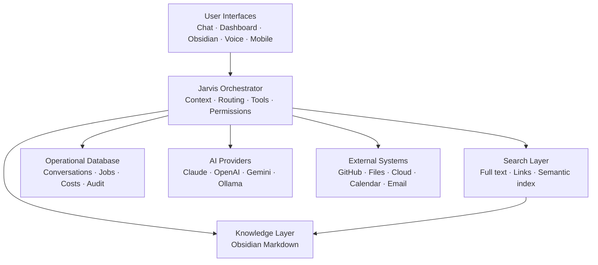

# AI Operating System

> A local-first, human-owned foundation for personal knowledge, AI assistance, and safe automation.

| Field | Value |
|---|---|
| Purpose | Orient contributors to the AI Operating System |
| Status | Foundation |
| Version | 0.1.0 |
| Owner | Jason |
| Revised | 2026-07-27 |

## Vision

AI Operating System is the engineering home for a long-term personal AI platform. It connects durable knowledge, interchangeable AI providers, external tools, and future applications without allowing any single model or vendor to own the system.

The architecture follows three clear responsibilities:

> **Obsidian stores knowledge. GitHub stores engineering artifacts. Jarvis orchestrates everything.**

The intended experience is simple: select a project, instantly understand where work stopped, give an approved AI the right context, complete useful work, and preserve the result as durable knowledge.

## Long-term goals

- Make knowledge portable, searchable, and useful across Claude, ChatGPT, Gemini, Ollama, and future models.
- Provide a safe orchestration layer for tools, agents, MCP integrations, and local automation.
- Resume any project from its current goals, decisions, sessions, code activity, and resources.
- Discover useful relationships and contradictions across projects.
- Support desktop, mobile, voice, and home-automation interfaces without coupling knowledge to any interface.
- Remain useful when an AI provider, database, index, or application is unavailable.

## Architecture overview



See [System Architecture](docs/SYSTEM_ARCHITECTURE.md) for boundaries and data flows.

## Philosophy

1. The human owns the knowledge.
2. Knowledge has one authoritative home.
3. External assets are referenced, not copied indiscriminately.
4. AI models reason; they do not become permanent memory.
5. Search indexes are derived and rebuildable.
6. Consequential actions require explicit permission.
7. Every meaningful AI session should improve the durable knowledge base.
8. Complexity must be earned through real usage.

## Repository structure

```text
AI-Operating-System/
├── README.md                 Project orientation
├── CONTRIBUTING.md           Contribution and review workflow
├── CHANGELOG.md              Version history
├── docs/                     Product and architecture specifications
│   ├── adr/                  Architecture Decision Records
│   ├── coordination/         Current project control and role routing
│   └── handovers/            Milestone handoffs and historical evidence
├── prompts/                  Versioned reusable prompts
├── templates/                Canonical Obsidian note templates
├── schemas/                  Machine-readable schema definitions
├── examples/                 Non-sensitive examples and fixtures
├── research/                 Time-bounded engineering investigations
├── meeting-notes/            Project governance records
├── src/                      Jarvis Core implementation
├── tests/                    Automated verification
├── scripts/                  Benchmarks and repository utilities
└── .github/                  GitHub collaboration configuration
```

## Current work and handoffs

Do not infer active scope from conversation history or from a feature branch name.

1. Start at [Project Control](docs/coordination/README.md).
2. Follow the [Handoff Router](docs/handovers/README.md).
3. Open only the milestone artifact marked **Current incoming artifact** for your role.
4. Apply [Governance](docs/GOVERNANCE.md) and
   [Ways of Working](docs/WAYS_OF_WORKING.md) when artifacts conflict.

## Roadmap

The accepted near-term sequence is:

1. v0.3 — Query Engine foundation
2. v0.3.1 — Query Trust Contracts
3. v0.4 — Read-only Project Resume CLI Pilot
4. v0.5 — Visible-Context Conversation

The broader capability milestones remain in the [Roadmap](docs/ROADMAP.md); the
[Version Roadmap](docs/product/VERSION_ROADMAP.md) records the version crosswalk and
preserves earlier planning assumptions.

## Obsidian and this repository

The Obsidian vault and this repository complement rather than duplicate one another.

| Obsidian vault | GitHub repository |
|---|---|
| Personal and project knowledge | Product and engineering specifications |
| Decisions about ongoing work | Architecture Decision Records for the software |
| AI session summaries | Prompts, templates, schemas, and implementation plans |
| Project dashboards and resources | Source code and technical tests when implementation begins |
| Human-editable context | Reviewed, version-controlled engineering artifacts |

[The BRAIN v2 specification](docs/THE_BRAIN_V2_SPEC.md) defines the vault. This repository defines and eventually implements the software that interacts with it.

## Working with the project

Start with:

1. [Project Control](docs/coordination/README.md) and the current incoming handoff
2. [Governance](docs/GOVERNANCE.md) and [Ways of Working](docs/WAYS_OF_WORKING.md)
3. [Operating Handbook](Operating%20Handbook%20-%20AI%20Agent%20Roles.md)
4. [The Jarvis Bible](docs/JARVIS_BIBLE.md)
5. [Product Vision](docs/PRODUCT_VISION.md) and [Product Strategy](docs/product/PRODUCT_STRATEGY.md)
6. [System Principles](docs/SYSTEM_PRINCIPLES.md)
7. [Version Roadmap](docs/product/VERSION_ROADMAP.md)
8. [The BRAIN v2](docs/THE_BRAIN_V2_SPEC.md)
9. [System Architecture](docs/SYSTEM_ARCHITECTURE.md) and [Security Threat Model](docs/reviews/SECURITY_THREAT_MODEL.md)
10. [Capability PRDs](docs/prd/README.md) and [ADRs](docs/adr/README.md)
11. The implementation, architecture-review, QA, and release-decision artifacts linked by
    the active milestone index

All human and AI contributions follow [CONTRIBUTING.md](CONTRIBUTING.md) and the [AI Behavior Standard](docs/AI_BEHAVIOR_STANDARD.md).

## Current status

Version `0.3` established the merged Query Engine foundation: deterministic lexical
retrieval, explainable ranking, citations, token-budgeted context, trace mode, and the
`search` / `summarize` / `explain` commands. Version `0.3.1` Query Trust Contracts was
released from merge commit `00f1813`; it adds authorization-before-
retrieval, passage/revision citations, stable source identity, versioned contracts, and
unambiguous relative-relevance terminology. The Product Owner and QA approved the frozen
executable `956c2ed`, and the release is identified by tag `v0.3.1`.

See the [v0.3.1 Handoff Index](docs/handovers/v0.3.1/README.md),
[Query Trust Contracts](docs/software/QUERY_TRUST_CONTRACTS.md), and
[Product Owner Release Decision](docs/handovers/v0.3.1/06-product-owner-to-librarian-release-decision.md).

The next planned product milestone is v0.4 Project Resume. Its planning package is
validated but implementation remains blocked. The earlier conversation candidate retains
its historical v0.4 branch identity but is parked, not merged, and scheduled for
reconciliation as v0.5.

## Related documents

- [Product Vision](docs/PRODUCT_VISION.md)
- [System Principles](docs/SYSTEM_PRINCIPLES.md)
- [Implementation Plan](docs/IMPLEMENTATION_PLAN.md)
- [Knowledge Standard](docs/KNOWLEDGE_STANDARD.md)
- [Vault Schema](docs/VAULT_SCHEMA.md)
- [Storage Architecture](docs/STORAGE_ARCHITECTURE.md)
- [Migration Execution Plan](docs/MIGRATION_EXECUTION_PLAN.md)
- [Architecture Decision Matrix](docs/ARCHITECTURE_DECISION_MATRIX.md)

## Revision history

| Version | Date | Change |
|---|---|---|
| 0.2.0 | 2026-07-27 | Added current-work routing, accepted release sequence, and merged v0.3/v0.3.1 status |
| 0.1.0 | 2026-07-27 | Initial engineering foundation |
