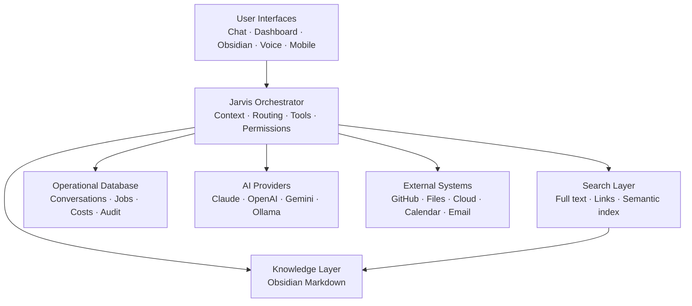

# AI Operating System

> A local-first, human-owned foundation for personal knowledge, AI assistance, and safe automation.

| Field | Value |
|---|---|
| Purpose | Orient contributors to the AI Operating System |
| Status | Foundation |
| Version | 0.1.0 |
| Owner | Jason |
| Revised | 2026-07-27 |

## Vision

AI Operating System is the engineering home for a long-term personal AI platform. It connects durable knowledge, interchangeable AI providers, external tools, and future applications without allowing any single model or vendor to own the system.

The architecture follows three clear responsibilities:

> **Obsidian stores knowledge. GitHub stores engineering artifacts. Jarvis orchestrates everything.**

The intended experience is simple: select a project, instantly understand where work stopped, give an approved AI the right context, complete useful work, and preserve the result as durable knowledge.

## Long-term goals

- Make knowledge portable, searchable, and useful across Claude, ChatGPT, Gemini, Ollama, and future models.
- Provide a safe orchestration layer for tools, agents, MCP integrations, and local automation.
- Resume any project from its current goals, decisions, sessions, code activity, and resources.
- Discover useful relationships and contradictions across projects.
- Support desktop, mobile, voice, and home-automation interfaces without coupling knowledge to any interface.
- Remain useful when an AI provider, database, index, or application is unavailable.

## Architecture overview



See [System Architecture](docs/SYSTEM_ARCHITECTURE.md) for boundaries and data flows.

## Philosophy

1. The human owns the knowledge.
2. Knowledge has one authoritative home.
3. External assets are referenced, not copied indiscriminately.
4. AI models reason; they do not become permanent memory.
5. Search indexes are derived and rebuildable.
6. Consequential actions require explicit permission.
7. Every meaningful AI session should improve the durable knowledge base.
8. Complexity must be earned through real usage.

## Repository structure

```text
AI-Operating-System/
├── README.md                 Project orientation
├── CONTRIBUTING.md           Contribution and review workflow
├── CHANGELOG.md              Version history
├── docs/                     Product and architecture specifications
│   └── adr/                  Architecture Decision Records
├── prompts/                  Versioned reusable prompts
├── templates/                Canonical Obsidian note templates
├── schemas/                  Machine-readable schema definitions
├── examples/                 Non-sensitive examples and fixtures
├── research/                 Time-bounded engineering investigations
├── meeting-notes/            Project governance records
└── .github/                  GitHub collaboration configuration
```

## Roadmap

The project advances through validated milestones:

1. Foundation
2. Knowledge System
3. Cross-AI Memory
4. Read-only Jarvis
5. Project Resume
6. Relationship Engine
7. Automation
8. Voice and additional interfaces

Each milestone has explicit dependencies and completion criteria in the [Roadmap](docs/ROADMAP.md). No Jarvis application code is included in the foundation release.

## Obsidian and this repository

The Obsidian vault and this repository complement rather than duplicate one another.

| Obsidian vault | GitHub repository |
|---|---|
| Personal and project knowledge | Product and engineering specifications |
| Decisions about ongoing work | Architecture Decision Records for the software |
| AI session summaries | Prompts, templates, schemas, and implementation plans |
| Project dashboards and resources | Source code and technical tests when implementation begins |
| Human-editable context | Reviewed, version-controlled engineering artifacts |

[The BRAIN v2 specification](docs/THE_BRAIN_V2_SPEC.md) defines the vault. This repository defines and eventually implements the software that interacts with it.

## Working with the project

Start with:

1. [Product Vision](docs/PRODUCT_VISION.md)
2. [System Principles](docs/SYSTEM_PRINCIPLES.md)
3. [The BRAIN v2](docs/THE_BRAIN_V2_SPEC.md)
4. [System Architecture](docs/SYSTEM_ARCHITECTURE.md)
5. [Architecture Decision Records](docs/adr/)
6. [Roadmap](docs/ROADMAP.md)
7. [Development Guide](docs/DEVELOPMENT_GUIDE.md)

All human and AI contributions follow [CONTRIBUTING.md](CONTRIBUTING.md) and the [AI Behavior Standard](docs/AI_BEHAVIOR_STANDARD.md).

## Current status

Version `0.1.0` establishes the documentation, governance, templates, schemas, and GitHub workflows required before implementation begins.

## Related documents

- [Product Vision](docs/PRODUCT_VISION.md)
- [System Principles](docs/SYSTEM_PRINCIPLES.md)
- [Implementation Plan](docs/IMPLEMENTATION_PLAN.md)
- [Knowledge Standard](docs/KNOWLEDGE_STANDARD.md)
- [Vault Schema](docs/VAULT_SCHEMA.md)

## Revision history

| Version | Date | Change |
|---|---|---|
| 0.1.0 | 2026-07-27 | Initial engineering foundation |
