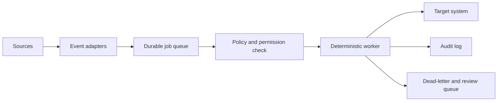

# Automation and Synchronization Architecture

| Field | Value |
|---|---|
| Purpose | Define safe event processing, synchronization, conflict handling, and background automation |
| Status | Draft — future architecture |
| Version | 0.1.0 |
| Owner | Jason |
| Revised | 2026-07-27 |
| Related | [System Architecture](SYSTEM_ARCHITECTURE.md), [Storage Architecture](STORAGE_ARCHITECTURE.md), [AI Behavior Standard](AI_BEHAVIOR_STANDARD.md), [Migration Plan](MIGRATION_EXECUTION_PLAN.md) |

## Scope

This document defines future synchronization and automation boundaries. It does not authorize background agents or live integrations.

## Model

## Integration patterns

| System | Preferred pattern | Canonical authority |
|---|---|---|
| Obsidian | File events plus periodic hash reconciliation | Vault |
| GitHub | Webhooks/API polling with commit SHA cursors | Repository |
| Cloud drives | Provider change tokens or scheduled reconciliation | Provider storage |
| Calendars | Provider event IDs and incremental sync tokens | Calendar provider |
| AI providers | Request/response records through Jarvis | No durable knowledge authority |
| Local folders | Scoped file watcher plus periodic inventory | Local file system |

## Event requirements

Every event carries:

- source system and stable source identifier;
- event type and observed timestamp;
- source revision, ETag, hash, or cursor;
- workspace/project scope;
- sensitivity classification;
- correlation and idempotency keys;
- requested action and approval class.

Events are facts about observed change, not permission to perform consequential actions.

## AI synchronization

AI sessions follow a controlled promotion path:

1. Jarvis assembles authorized context.
2. The provider returns analysis or a proposed artifact.
3. Jarvis records operational metadata.
4. A session summary, decision, or note update is drafted.
5. The human approves durable vault writes.
6. The accepted artifact is written with provenance.

Provider-native memory may improve a session but is never the only durable copy.

## Background agents and scheduled jobs

Initially permitted unattended work is read-only:

- health checks;
- inventory and drift reports;
- link validation;
- index rebuilding;
- backup verification;
- stale-project and inbox reminders.

Writes, external messages, moves, merges, deletion, and conflict resolution require the permission level defined by policy. A schedule does not weaken an approval requirement.

## Conflict resolution

1. Detect divergence using revision IDs or hashes.
2. Stop automatic writes to the affected object.
3. Preserve both versions and their provenance.
4. Classify the conflict: identical, append-only, metadata-only, semantic, or destructive.
5. Produce a comparison and recommended canonical result.
6. Require human approval.
7. Record the resolution and update cursors.

Last-write-wins is not acceptable for durable knowledge.

## Idempotency and replay

- Reprocessing an event must not duplicate notes, messages, or actions.
- Workers store outcome and target revision against an idempotency key.
- Retries use bounded backoff.
- Poison events move to a review queue.
- Replay re-runs current authorization checks.

## Audit logging

Record actor, model/automation identity, source event, input references, proposed action, approval, timestamps, target, before/after revisions, outcome, and error. Logs must redact secrets and follow sensitivity-based retention.

## GitHub synchronization

- GitHub remains authoritative for code and repository engineering artifacts.
- Vault project dashboards store stable repository links and summarized context.
- Commit, issue, and PR data may be indexed or summarized, not copied wholesale.
- Vault-to-repository publication requires an explicit workflow and declared canonical source.

## Obsidian synchronization

- Ignore transient and derived plugin data unless explicitly needed.
- Debounce file events and validate a file is stable before reading.
- Do not rewrite a note being actively edited.
- Use atomic writes and compare the expected pre-write hash.
- Reconcile periodically because file-watch events can be missed.

## Delivery stages

1. Manual, read-only integrations.
2. Scheduled inventory and health reports.
3. Rebuildable indexes.
4. Approval-driven capture and session summaries.
5. Provider webhooks and incremental sync.
6. Narrow pre-approved workflows with monitoring.

## Revision history

| Version | Date | Change |
|---|---|---|
| 0.1.0 | 2026-07-27 | Initial future automation and synchronization architecture |
