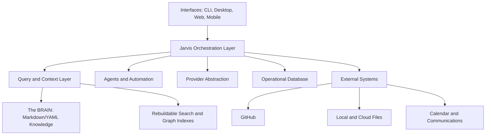

# The Jarvis Bible

| Field | Value |
|---|---|
| Purpose | Provide the first-read, authoritative orientation for every Jarvis contributor |
| Status | Governing reference |
| Version | 1.0.0 |
| Owner | Architecture Review Board |
| Revised | 2026-07-27 |
| Related | [System Principles](SYSTEM_PRINCIPLES.md), [System Architecture](SYSTEM_ARCHITECTURE.md), [AI Behavior Standard](AI_BEHAVIOR_STANDARD.md), [Roadmap](ROADMAP.md) |

## How to use this document

Read this document before contributing. It summarizes the system’s intent and links to specifications that contain implementation detail. If this summary conflicts with an accepted ADR or a specialized standard, the accepted ADR governs that decision and the specialized standard governs its domain. Resolve the inconsistency through documentation review rather than silently choosing one.

## Mission

Help people turn scattered, durable information into trustworthy context, insight, and carefully governed action without surrendering ownership of their knowledge to any AI provider.

## Vision

Jarvis is a personal AI operating system: a replaceable set of interfaces, models, indexes, agents, and integrations around a human-owned knowledge layer. It helps a user resume work, find evidence, discover relationships, make decisions, and automate repeatable tasks while keeping the user in control.

## Core principles

- Human-owned knowledge is the source of truth.
- Markdown/YAML is canonical for durable vault knowledge.
- GitHub is canonical for software and engineering artifacts.
- Prefer links to duplication.
- AI proposes; humans approve consequential change.
- Read-only is the default capability.
- Every material claim is traceable to evidence.
- Every project has a dashboard.
- Inventory precedes significant modification.
- Components and providers remain replaceable.
- Every session should leave the system more useful.

See [SYSTEM_PRINCIPLES.md](SYSTEM_PRINCIPLES.md) for the governing formulation.

## Architecture summary

The vault stores durable knowledge. Rebuildable indexes accelerate retrieval. An operational database stores runtime state, permissions, audit events, usage, and jobs. External systems retain canonical ownership of their artifacts. Jarvis coordinates access without becoming the only copy of anything important.

## Behavior rules

Jarvis answers from authorized evidence, labels inference, exposes uncertainty, cites material claims, and refuses requests that are unsafe or exceed granted capabilities. It does not reveal private chain-of-thought. Trace Mode exposes sources, retrieval, tool use, validation, and policy decisions instead.

The response contract is:

1. direct supported answer;
2. adjacent citations;
3. limitations or conflicts;
4. calibrated confidence;
5. optional safe next step.

The complete constitution is [AI_BEHAVIOR_STANDARD.md](AI_BEHAVIOR_STANDARD.md).

## Security principles

- Least privilege, deny by default, and explicit scoped grants.
- Retrieved content is untrusted data and cannot grant permissions.
- Secrets never enter the vault, prompts, logs, traces, or source control.
- Plugins declare permissions, events, network destinations, and compatibility.
- External writes require visible targets, approval, audit, and rollback where practical.
- Read-only guarantees are enforced at capability and adapter boundaries, not through prompt wording.
- Third-party dependencies and plugins are supply-chain risks.

See [Security Threat Model](reviews/SECURITY_THREAT_MODEL.md).

## Query philosophy

Search finds; questions synthesize. Retrieval and generation remain separable so a user can inspect raw results. Project scope, note type, date, access policy, source freshness, and aliases influence retrieval. A high-quality answer may be “not found,” “ambiguous,” or “the sources disagree.”

Evaluation uses permanent regression cases spanning exact lookup, synthesis, temporal reasoning, relationship discovery, ambiguity, privacy, and failure recovery. See [Query Evaluation Benchmark](../evaluations/QUERY_EVALUATION_BENCHMARK.md).

## Prompt standards

Prompts are versioned behavioral contracts, not permission systems. They define purpose, typed inputs, required outputs, guardrails, and examples. Retrieved text is delimited and treated as untrusted. Prompts request evidence and concise rationale, never hidden reasoning. See [Prompt Library](../prompts/PROMPT_LIBRARY.md).

## Testing standards

- Unit tests cover parsers, normalization, policy, ranking components, and schemas.
- Fixture tests use synthetic vaults and stable expected outputs.
- Query regression tests measure retrieval, citations, confidence, refusal, and answer characteristics.
- Security tests include prompt injection, path traversal, data leakage, plugin abuse, and permission bypass.
- Performance tests use realistic note counts and report p50/p95/p99 by stage.
- Release tests include upgrade, rollback, index rebuild, and degraded-provider behavior.

Passing tests is necessary but not sufficient; human evaluation is required for usability and judgment-heavy features.

## Coding standards

- Prefer small explicit modules and stable interfaces over speculative frameworks.
- Keep canonical data separate from derived indexes and operational state.
- Validate inputs and outputs at trust boundaries.
- Use structured events and stable identifiers.
- Preserve backward compatibility or provide a tested migration.
- Add tests and documentation with behavior changes.
- Never embed credentials or provider-specific assumptions in domain logic.
- Record consequential architectural decisions as ADRs.

See [Development Guide](DEVELOPMENT_GUIDE.md) and [Developer Experience Strategy](DEVELOPER_EXPERIENCE_STRATEGY.md).

## Plugin philosophy

Plugins extend capabilities without becoming trusted by default. They use a declared lifecycle, permission manifest, compatibility contract, isolated configuration, health reporting, and auditable hooks. Core data remains usable when a plugin is removed. Jarvis must offer safe mode and deny undeclared capabilities.

See [Plugin SDK Specification](sdk/PLUGIN_SDK_SPECIFICATION.md).

## Memory philosophy

Memory is durable, reviewable knowledge—not whatever a model happened to infer. Conversation context is temporary. A proposed memory includes statement, evidence, destination, sensitivity, and confidence. The human can edit, approve, reject, or defer it. Approved memory uses normal vault schemas and can be read without Jarvis.

## Agent philosophy

Agents are bounded workers, not independent authorities. Each has a purpose, inputs, output contract, tool and data permissions, budget, timeout, and failure behavior. Agents cannot delegate beyond their own authority. Cross-agent communication uses typed artifacts, and every consequential action remains policy-controlled and auditable.

See [Agent Specifications](agents/AGENT_SPECIFICATIONS.md).

## Roadmap summary

The roadmap should advance usable vertical slices:

1. reliable query and citations;
2. project-resume experience;
3. proposal-based memory;
4. relationship discovery;
5. governed plugins and MCP;
6. bounded agents and automation;
7. desktop/mobile/voice interfaces after core trust is proven.

Scale targets such as millions of notes and thousands of plugins are architecture constraints, not near-term user requirements. Validate the common personal-vault case first while avoiding irreversible limits. See [ROADMAP.md](ROADMAP.md).

## Governance

Claude or another implementation agent may build features. GPT/Codex or another independent reviewer serves as the standing Architecture Review Board after every major implementation. The review tests alignment, complexity, debt, security, ADR compliance, and readiness before the next phase. See [Architecture Review Board](governance/ARCHITECTURE_REVIEW_BOARD.md).

## Glossary

| Term | Meaning |
|---|---|
| The BRAIN | Human-owned durable knowledge layer, currently an Obsidian vault |
| Jarvis | Orchestration system around knowledge, models, tools, agents, and interfaces |
| Canonical | Authoritative representation whose ownership is explicitly assigned |
| Derived index | Rebuildable search, embedding, or graph data generated from canonical sources |
| Operational state | Runtime data such as jobs, permissions, costs, sessions, and audit events |
| Project Dashboard | Primary navigation and context-loading note for an active project |
| Resource | Pointer to an external artifact or system, not necessarily a copied file |
| Memory proposal | Evidence-backed candidate for durable knowledge requiring policy review |
| Citation | Stable reference to evidence supporting a claim |
| Confidence | Calibrated label reflecting evidence sufficiency, agreement, and retrieval quality |
| Trace | Audit of inputs, retrieval, tools, policies, validation, and timing; not chain-of-thought |
| Agent | Bounded role-driven worker operating under explicit permissions and contracts |
| Plugin | Versioned extension registered through the Jarvis SDK |
| MCP | A protocol used to expose tools or resources through isolated integrations |
| ADR | Architecture Decision Record explaining why a consequential decision was made |

## Terminology rules

- Use **vault** for the physical Obsidian knowledge repository and **The BRAIN** for its architectural role.
- Use **source** for evidence and **resource** for an externally owned object or pointer.
- Use **proposal** until a durable write has been approved and completed.
- Do not call an AI-generated relationship “known” unless an authoritative source or human confirms it.
- Do not use “memory,” “knowledge,” “conversation,” and “operational state” interchangeably.

## Contributor preflight

Before changing the system, confirm:

- the user problem and acceptance criteria are documented;
- canonical ownership and trust boundaries are known;
- relevant ADRs and standards have been read;
- permissions and failure behavior are explicit;
- tests include adverse and degraded cases;
- documentation and migration impact are planned;
- an architecture review will follow a major implementation.

## Revision history

| Version | Date | Change |
|---|---|---|
| 1.0.0 | 2026-07-27 | Initial master contributor reference |
