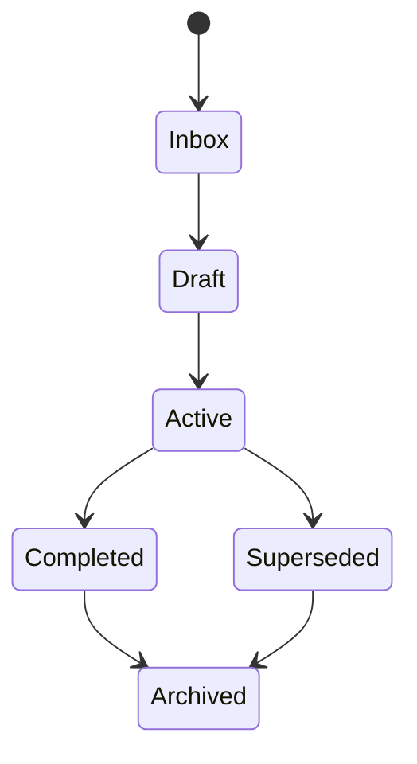

# Knowledge Standard

| Field | Value |
|---|---|
| Purpose | Define implementation rules for durable knowledge |
| Status | Draft |
| Version | 0.1.0 |
| Owner | Jason |
| Revised | 2026-07-27 |
| Related | [The BRAIN v2](THE_BRAIN_V2_SPEC.md), [Vault Schema](VAULT_SCHEMA.md), [AI Behavior](AI_BEHAVIOR_STANDARD.md) |

## Authority

The BRAIN v2 specification is authoritative for the conceptual model. This document converts it into testable operating rules.

## Required rules

1. Durable notes use UTF-8 Markdown and YAML frontmatter.
2. Each durable note has a stable `id`, controlled `type`, canonical `title`, lifecycle `status`, `created`, `updated`, and `sensitivity`.
3. Dates use ISO `YYYY-MM-DD`.
4. Wikilinks represent vault entities; URLs and resource notes reference external systems.
5. One authoritative editable copy exists for each artifact.
6. Accepted decisions and meaningful AI sessions are first-class notes.
7. Secrets never enter the vault or repository.
8. Structural changes are proposed, reviewed, logged, and recoverable.

## Naming

- Note titles use natural title case.
- IDs use lowercase type prefixes and stable identifiers, for example `decision-20260727-001`.
- Filenames should match canonical titles unless a date-based convention applies.
- Do not encode a changeable folder path into an ID.
- Add aliases instead of creating synonym notes.

## Links and relationships

Create a link when it answers why two objects are related. Do not add links solely to increase graph density.

Use properties for repeatable, machine-readable relationships (`projects`, `areas`, `people`, `organizations`) and prose for nuanced context.

## Provenance

Research claims and AI-generated conclusions identify their sources and confidence. External resource notes record authority and last verification when appropriate.

## Lifecycle

Not every note uses every state. Status values are controlled in the [Vault Schema](VAULT_SCHEMA.md).

## Quality checks

A future validator should verify:

- YAML parses;
- required properties exist;
- IDs are unique;
- property values match controlled vocabularies;
- wikilinks resolve or are intentionally unresolved;
- dates are valid;
- resource paths and URLs use approved forms; and
- templates remain compatible with the schema.

## Revision history

| Version | Date | Change |
|---|---|---|
| 0.1.0 | 2026-07-27 | Initial knowledge implementation standard |
