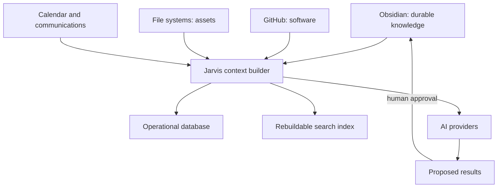

# Storage Architecture

| Field | Value |
|---|---|
| Purpose | Define ownership, persistence boundaries, retention, recovery, and synchronization for system data |
| Status | Draft |
| Version | 0.1.0 |
| Owner | Jason |
| Revised | 2026-07-27 |
| Related | [System Architecture](SYSTEM_ARCHITECTURE.md), [System Principles](SYSTEM_PRINCIPLES.md), [Vault Schema](VAULT_SCHEMA.md), [ADR-0001](adr/ADR-0001-The-Brain-Is-The-Durable-Knowledge-Layer.md), [ADR-0003](adr/ADR-0003-GitHub-Is-The-Source-Of-Truth-For-Code.md) |

## Architectural rule

Every durable object has one canonical owner. Other layers may store pointers, caches, summaries, projections, or publication copies, but they must identify their authority and reconciliation behavior.

## Storage domains

| Data class | Canonical owner | Format | Examples |
|---|---|---|---|
| Durable knowledge | Obsidian vault | Markdown, YAML, attachments where appropriate | Projects, decisions, concepts, research, session summaries |
| Software engineering | GitHub repository | Git-managed source and docs | Code, tests, ADRs, issues, releases |
| Working and binary assets | Local/cloud file systems | Native formats | PDFs, spreadsheets, images, datasets |
| Events | Calendar provider | Provider records | Meetings, deadlines, reminders |
| Communications | Email/chat provider | Provider records | Email threads, Slack/Teams messages |
| Operational state | Jarvis database | Initially SQLite | Conversations, approvals, executions, schedules, usage |
| Search projections | Rebuildable index | Full text, graph, embeddings | Chunks, entities, vectors, backlinks |
| Secrets | OS/provider secret store | Encrypted | API keys, tokens, credentials |
| Logs | Jarvis operational store | Structured records | Audit, errors, job history |

## Canonical ownership



When two systems contain editable copies, one must be declared authoritative and the other marked as generated, published, cached, or deprecated.

## Vault storage

The vault stores durable human-readable knowledge and stable external references. It does not store:

- API keys or tokens;
- high-volume telemetry;
- embeddings as canonical records;
- application databases;
- copies of every repository README or binary asset;
- unreviewed bulk AI output.

Vault writes use atomic replacement where practical, preserve provenance, and require the approval rules in [AI Behavior Standard](AI_BEHAVIOR_STANDARD.md).

## Operational database

SQLite is the expected first local runtime store, but the choice remains provisional until runtime requirements are validated. Operational data includes:

- conversations and messages;
- tool requests and approvals;
- task and workflow state;
- provider latency, tokens, and cost;
- connector cursors and health;
- dashboard layout and user settings;
- audit events.

Durable decisions or reusable knowledge discovered in operational data must be promoted to the vault through review; the database must not silently become a second knowledge base.

## Search storage

Indexes are projections and must be disposable. Each indexed record should retain:

- canonical source URI or vault path;
- source revision or content hash;
- section/chunk locator;
- index model and version;
- indexed timestamp;
- sensitivity and workspace scope.

Deleting and rebuilding the index must not destroy knowledge.

## Resource identifiers

Use typed, explicit references:

```yaml
resources:
  - type: github
    uri: https://github.com/JMurray40/AI-Operating-System
    authority: software-source
  - type: local-folder
    uri: C:\Projects\Example
    authority: working-files
  - type: website
    uri: https://example.com
    authority: published-output
```

Do not assume a local path exists on every device. Store human-readable labels and stable provider identifiers where available.

## Backup and recovery

| Store | Minimum recovery strategy |
|---|---|
| Vault | Versioned, verified copy outside the vault plus periodic restore tests |
| GitHub | Local clone and remote history; protected main branch when practical |
| Operational DB | Consistent snapshot plus schema/version record |
| Files | Provider versioning or separate backup appropriate to value |
| Search index | Rebuild from canonical sources |
| Secrets | Provider recovery process; never export into ordinary backups |

Backup success means restoration was verified, not merely that copying was attempted.

## Retention

- Durable knowledge and accepted decisions: retain until explicitly superseded or archived.
- Raw AI transcripts: retain only when evidentiary value justifies privacy and storage cost.
- Session summaries: retain as durable knowledge.
- Operational logs: configurable retention, longer for consequential actions.
- Embeddings and caches: regenerate when models, schemas, or source hashes change.

## Failure and conflict behavior

- Prefer safe read-only degradation when authority is unavailable.
- Never overwrite divergent versions automatically.
- Compare revisions, preserve both versions, and request human resolution.
- Record the selected canonical version and why.
- Queue writes only when replay is idempotent and still requires the appropriate approval.

## Open decisions

- Final operational database and migration threshold beyond SQLite.
- Vault synchronization provider and multi-device conflict policy.
- Encryption and retention requirements by sensitivity class.
- Attachment policy for small durable artifacts.

These require ADRs before implementation becomes dependent on them.

## Revision history

| Version | Date | Change |
|---|---|---|
| 0.1.0 | 2026-07-27 | Initial storage boundaries and ownership model |
