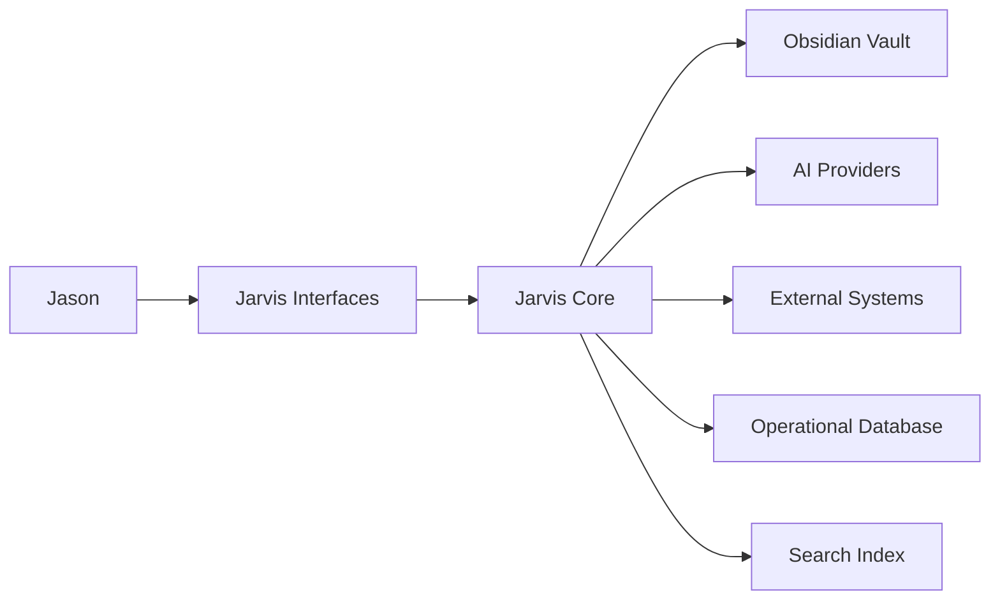
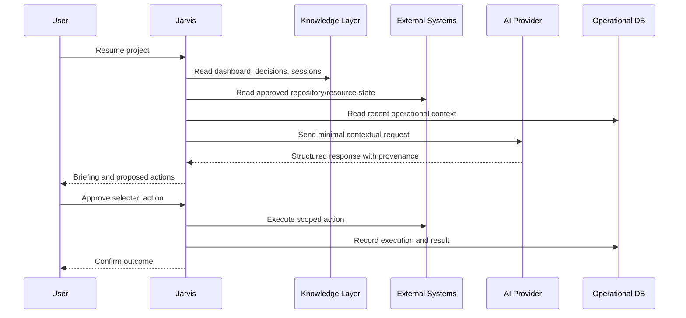
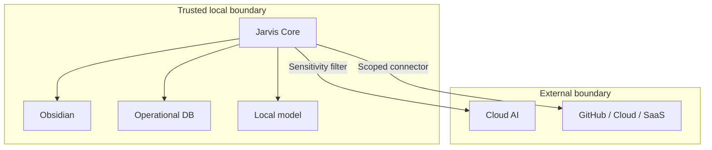

# System Architecture

| Field | Value |
|---|---|
| Purpose | Define system components, boundaries, and data flows |
| Status | Draft |
| Version | 0.1.0 |
| Owner | Jason |
| Revised | 2026-07-27 |
| Related | [Product Vision](PRODUCT_VISION.md), [The BRAIN v2](THE_BRAIN_V2_SPEC.md), [ADRs](adr/) |

## Architectural drivers

- Human ownership and portability.
- Safe access to personal and business systems.
- Interchangeable AI providers.
- Useful operation while disconnected from cloud providers.
- Auditable, recoverable changes.
- A fast path to a read-only MVP.

## Context

## Component model

### Knowledge Layer

The Obsidian vault contains durable knowledge: project context, decisions, research, concepts, resources, and AI session summaries. Markdown and YAML remain directly accessible. See [ADR-0001](adr/ADR-0001-The-Brain-Is-The-Durable-Knowledge-Layer.md) and [ADR-0002](adr/ADR-0002-Markdown-Is-The-Canonical-Storage.md).

The Knowledge Layer does not contain API secrets, high-volume execution logs, model costs, embeddings, or copies of every external asset.

### Jarvis Layer

Jarvis is an orchestration boundary with six responsibilities:

1. authenticate the user and enforce workspace scope;
2. assemble task-specific context;
3. route requests to model roles;
4. expose approved tools through a registry;
5. manage human approvals and workflows; and
6. record operational provenance and results.

Jarvis must not be the sole holder of durable knowledge.

### Search Layer

Search progresses from simple to advanced:

- file and metadata inventory;
- full-text search;
- wikilink and backlink graph;
- extracted entities;
- section-level embeddings;
- similarity and contradiction candidates.

All indexes are derived from authoritative sources and can be rebuilt. Similarity is advisory, not proof.

### Operational Database

The operational store contains:

- conversations and messages;
- tool executions and approval state;
- jobs and schedules;
- model usage, latency, and cost;
- dashboard configuration;
- connector state; and
- audit records.

SQLite is appropriate for the first local deployment. Its schema is separate from the vault schema.

### AI Providers

Providers implement a common internal contract. Jarvis uses role aliases such as `coding`, `research`, `fast`, `private`, and `vision`, not provider model names throughout the application.

Provider adapters normalize:

- messages and streaming;
- tool calls;
- structured output;
- usage and cost;
- timeouts, retries, and fallbacks; and
- safety and data-handling metadata.

Initial targets are Claude, OpenAI, Gemini, and Ollama.

### External Systems

External systems remain authoritative for their data:

| System | Authority |
|---|---|
| GitHub | Code, issues, pull requests, releases |
| Local/cloud storage | Files and binary assets |
| Calendars | Events |
| Email and messaging | Messages |
| Business applications | Domain records |

Adapters expose narrow capabilities and stable identifiers. Writes require the configured permission level.

## Primary data flow

## Trust boundaries

Private or restricted content must not cross the external boundary without an explicit policy and approval.

## Future integrations

- MCP servers for reusable third-party capabilities.
- Obsidian companion plugin for contextual commands and change notifications.
- Desktop wrapper and system tray.
- Mobile interface and notifications.
- Home Assistant.
- Voice input and output.
- Additional local models and hardware accelerators.

Each integration must define authority, identifiers, permissions, synchronization direction, conflicts, provenance, and recovery behavior.

## Deployment evolution

1. Local web application with a Python API and SQLite.
2. Local background services for indexing and scheduled work.
3. Desktop packaging.
4. Optional remote access with explicit authentication.
5. Mobile clients calling the same API.

## Open architecture questions

- Exact vault API boundary: direct Markdown access first or a dedicated knowledge service.
- Authentication strategy before any remote access.
- Connector credential storage on Windows.
- Model gateway implementation.
- Indexing technology after the read-only pilot.

## Revision history

| Version | Date | Change |
|---|---|---|
| 0.1.0 | 2026-07-27 | Initial component and trust architecture |
