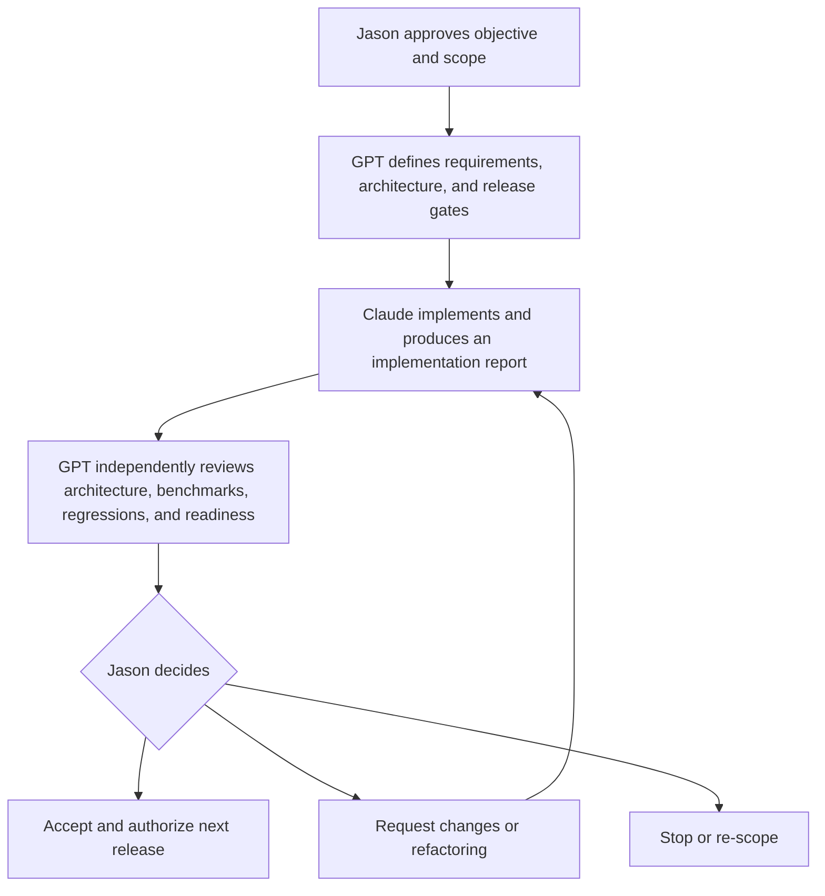

# AI Operating System (Jarvis) — Project Turnover

| Field | Value |
|---|---|
| Purpose | Transfer current project context, decisions, responsibilities, risks, and next actions into a new project or AI session |
| Status | Historical program baseline; superseded for current execution routing |
| Version | 1.0.0 |
| Owner | Jason Murray |
| Prepared | 2026-07-27 |
| Repository | `JMurray40/AI-Operating-System` |
| Primary branch | `main` |
| Related | [Jarvis Bible](../JARVIS_BIBLE.md), [Product Strategy](../product/PRODUCT_STRATEGY.md), [Version Roadmap](../product/VERSION_ROADMAP.md) |

> **Current-state notice:** This turnover preserves the program state and recommendations
> recorded after v0.3. It is not the current incoming artifact. Start at
> [Project Control](../coordination/README.md) and the
> [Handoff Router](README.md) for current execution.

## 1. Executive context

Jarvis is a local-first personal AI operating system built around a human-owned Obsidian knowledge base called **The BRAIN**.

The governing division of responsibility is:

> **Obsidian stores durable knowledge. GitHub stores engineering artifacts. Jarvis orchestrates models, context, tools, and external systems.**

Jarvis is not intended to become one irreplaceable chatbot or to allow one AI provider to own the user's memory. Claude, ChatGPT, Gemini, Ollama, and future providers should operate against shared, portable, governed knowledge.

The project is currently a well-documented, tested engineering prototype. It is not yet a polished end-user product or commercially validated platform.

## 2. Mission

Help a user turn fragmented work across projects, files, repositories, software, and AI providers into trustworthy context, durable knowledge, and carefully governed action without surrendering ownership or control.

## 3. Product thesis

The first indispensable workflow should be **Project Resume**:

1. Select a project.
2. Retrieve its current objectives, recent sessions, decisions, tasks, repository activity, and external resources.
3. Show a sourced, read-only briefing.
4. Allow the user to inspect and correct the context.
5. Complete work using an approved AI.
6. Propose a durable session summary or decision.
7. Require human approval before saving it.
8. Make the next project resumption faster.

The project should prove this loop before investing heavily in general agents, voice, mobile, a plugin marketplace, team workspaces, or enterprise infrastructure.

## 4. Operating roles

| Role | Assigned to | Responsibility | Authority |
|---|---|---|---|
| Product Owner | Jason | Vision, priorities, scope, risk acceptance, and final decisions | Final approval |
| Chief Architect / CTO | GPT | Product strategy, architecture, roadmap, ADR review, and technical-debt oversight | Recommends; does not authorize |
| Principal Engineer | Claude | Implementation, automated tests, refactoring, documentation updates, and performance work | Implements approved scope |
| Quality & Release Manager | GPT or a separate GPT reviewer | Independent benchmarks, regression analysis, release readiness, documentation validation, and architectural review | Issues release recommendation |

### Separation-of-responsibilities rule

When GPT serves as both architect and release reviewer, it must conduct the release review as a distinct evidence-based activity. It must not approve an implementation merely because it follows GPT's earlier recommendation.

The review outcome must be one of:

- **Ready**
- **Ready with conditions**
- **Refactor first**
- **Not ready**
- **Re-scope**

Jason retains final authority in every case.

## 5. Working sequence



## 6. Completed milestones

### v0.1 — Core Prototype

- Read-only Obsidian vault parser
- Markdown/YAML metadata handling
- Knowledge-graph construction
- Context builder
- Provider abstraction
- Mock AI provider
- CLI foundation
- Validation framework
- Test fixtures
- CI/CD and automated tests
- Foundational engineering documentation

### v0.2 — Real Vault Pilot

- Real Obsidian vault support
- Vault health analysis
- Folder, metadata, link, orphan, and defect reporting
- Performance instrumentation
- Synthetic scale testing at 100, 500, and 1,000 notes
- Read-only validation
- Initial AI Operating System and Cloud Organizer Pro knowledge pilots

### v0.3 — Intelligent Query Engine Foundation

- Dedicated `jarvis_core.query` layer
- Deterministic tokenizer
- In-memory lexical index
- Intent parser
- Explainable ranker
- Token-budgeted context builder
- Provider-independent context assembly
- Source-note citations
- Trace Mode
- CLI commands: `ask`, `search`, `summarize`, and `explain`
- Reported 124 passing tests
- Reported Ruff and mypy success
- Approximately 43 ms query time over 1,000 synthetic notes
- ADR-0012 documenting the layered deterministic query pipeline

The implemented v0.3 work is the **Query Engine foundation**, not the entire originally planned “Read-only Chat and Provenance” milestone. Chat, conversation storage, and real provider adapters remain incomplete.

## 7. Documentation completed

The repository includes:

- Product Vision and Product Strategy
- System Principles and Jarvis Bible
- The BRAIN v2 specification
- System, storage, automation, and synchronization architecture
- Knowledge standard, vault schema, and naming/taxonomy
- Migration execution plan
- Product roadmap and implementation plan
- Ten capability PRDs
- Agent specifications
- Plugin SDK specification
- Security threat model
- Developer Experience Strategy
- Engineering Quality Checklists
- 100-item Future Research Backlog
- 260-case Query Evaluation Benchmark specification
- Prompt library
- Demo vault specification
- UX and interaction specification
- Competitive analysis
- Architecture Decision Records
- Standing Architecture Review Board procedure

## 8. Current architectural assessment

The executive review assessed Jarvis as:

> A well-governed prototype with a credible product thesis, but not yet a finished product or proven platform.

| Area | Maturity score |
|---|---:|
| Architecture | 7/10 |
| Product direction | 7/10 |
| Engineering maturity | 6/10 |
| Documentation quality | 9/10 |
| Scalability | 4/10 |
| Maintainability | 7/10 |
| Technical-debt control | 7/10 |
| Risk management | 6/10 |
| Overall | 6.6/10 |

The recommendation is to continue investing for 9–12 months as a staged product-validation program, not yet as a broad platform or enterprise initiative.

## 9. v0.3 Architecture Review Board decision

**Disposition: Ready with conditions.**

The Query Engine is approved for an offline, read-only Project Resume pilot. It is not approved for cloud AI providers, sensitivity-bearing multi-user data, plugins, MCP tools, durable memory, or automation.

### Required conditions

| ID | Required action | Blocking gate |
|---|---|---|
| C1 | Rename retrieval `confidence` to relative relevance and define separate answer-confidence semantics | Real provider or chat |
| C2 | Make the context token budget a true tested invariant | Real provider |
| C3 | Add claim-supporting passage anchors, excerpts, and source revisions to citations | Generated answers |
| C4 | Enforce authorization and sensitivity before candidate retrieval and graph expansion | Any expanded trust boundary |
| C5 | Reconcile v0.3 roadmap naming, incomplete chat/provider scope, and completion criteria | Milestone closure |

### Recommended refactors

- Introduce a `Retriever` port before persisted or hybrid retrieval.
- Precompute incoming and outgoing graph adjacency.
- Consolidate the legacy and rich answer surfaces.
- Add request ID, vault fingerprint, index version, policy decisions, and prompt/provider versions to Trace Mode.
- Represent graph-selected and relevance-ranked results as distinct typed channels.

## 10. Accepted design principles

1. Human-owned knowledge is the source of truth.
2. Markdown/YAML is canonical for durable vault knowledge.
3. GitHub is canonical for software and engineering artifacts.
4. External artifacts should be referenced rather than duplicated.
5. AI proposes; humans approve consequential change.
6. Read-only is the default capability.
7. Every material answer should be traceable to evidence.
8. Every active project should have a Project Dashboard.
9. Inventory precedes significant modification.
10. Providers, indexes, interfaces, and integrations should remain replaceable.
11. Every meaningful session should improve durable knowledge.
12. Operational simplicity is a product feature.

## 11. Current source-of-truth boundaries

| Information | Canonical owner |
|---|---|
| Durable knowledge, decisions, project context, session summaries | Obsidian vault |
| Software, engineering specifications, ADRs, tests, and release artifacts | GitHub |
| Source code | GitHub repository |
| Large documents, spreadsheets, images, and other assets | Their existing local or cloud systems |
| Search and graph indexes | Rebuildable Jarvis projections |
| Conversations, jobs, permissions, costs, and audit events | Future operational database |
| Secrets and API credentials | Approved secrets store; never Obsidian or Git |

## 12. Recommended release sequence

1. **v0.3.1 — Query Trust Contracts**
2. **v0.4 — Read-only Project Resume CLI Pilot**
3. **v0.4.1 — Real-Vault Evaluation and Executable Benchmarking**
4. **v0.5 — Visible-Context Chat**
5. **v0.6 — Proposed Memory**
6. **v0.7 — Hybrid Retrieval and Relationship Intelligence**
7. **v0.8 — Capability and Tool Gateway**
8. **v0.9 — Curated Plugins and MCP**
9. **v0.10 — Bounded Workflow Preview**
10. **v1.0 — Trusted Personal Jarvis**

General agents, broad automation, voice, mobile depth, team workspaces, a marketplace, and enterprise platform work should remain post-v1.0 unless real user evidence materially changes the priorities.

## 13. Immediate next actions

### Product Owner — Jason

1. Review and accept or revise the v0.3 ARB conditions.
2. Decide whether the remaining chat/provider work moves to v0.5 under the revised roadmap.
3. Authorize v0.3.1 trust-contract hardening.
4. Select AI Operating System and Cloud Organizer Pro as the initial Project Resume pilots.
5. Define a weekly dogfood review:
   - project-resume attempts;
   - time saved;
   - incorrect or missing context;
   - citation defects;
   - metadata maintenance time;
   - features requested.

### Chief Architect / CTO — GPT

1. Produce implementation-ready requirements for v0.3.1.
2. Draft or update ADRs covering:
   - retrieval relevance versus answer confidence;
   - authorization and sensitivity scope;
   - passage/revision citation contract;
   - stable entity and source identity.
3. Reconcile the product roadmap and release numbering.
4. Define v0.4 Project Resume acceptance tests.

### Principal Engineer — Claude

After Jason approves the scope:

1. Implement v0.3.1 only.
2. Preserve read-only operation.
3. Add tests for every ARB condition.
4. Do not add real providers, embeddings, writes, plugins, MCP, agents, or background services.
5. Submit an implementation report including:
   - changed contracts;
   - migrations and compatibility;
   - tests and results;
   - benchmark changes;
   - security analysis;
   - technical debt;
   - deviations;
   - recommended next step.

### Quality & Release Manager — GPT

1. Independently execute the query benchmark and release checklist.
2. Review citation validity, scope enforcement, budget invariants, compatibility, and documentation.
3. Compare the implementation against the approved requirements and ADRs.
4. Issue one formal release disposition.
5. Send unresolved risks to Jason for final decision.

## 14. Recommended v0.3.1 implementation brief

```text
Implement v0.3.1 — Query Trust Contracts only.

Read the Jarvis Bible, AI Behavior Standard, v0.3 Architecture Review,
ADR-0012, Search PRD, Security Threat Model, and this turnover document.

Required outcomes:

1. Replace ambiguous retrieval confidence terminology with relative relevance.
2. Define separate answer-confidence semantics without pretending it is a probability.
3. Enforce a strict context token-budget contract, including oversized first notes.
4. Add passage/section anchors, excerpts, and source revision or fingerprint to citations.
5. Add an authorization request scope applied before candidate generation and graph expansion.
6. Ensure excluded notes cannot appear in context, citations, or Trace Mode.
7. Version affected result and trace contracts with a documented compatibility plan.
8. Reconcile v0.3 release documentation.

Constraints:

- Remain strictly read-only.
- Do not add real AI providers.
- Do not add embeddings, a vector database, persisted indexes, plugins, MCP, agents,
  automation, background watchers, or write capability.
- Add positive, negative, boundary, compatibility, and regression tests.

Before implementation, present the plan, affected contracts, acceptance tests,
security implications, and migration approach for approval.

When complete, produce the standard implementation report for independent
Architecture Review Board and release review.
```

## 15. Evidence required before investing another year

- Project Resume is used repeatedly for at least eight weeks.
- It saves at least 15–30 minutes during meaningful project switches.
- At least 90–95% of material briefing claims are correctly sourced.
- Correction and metadata-maintenance time remains below the value saved.
- A non-author can install, use, diagnose, and recover the application.
- Five to ten external design partners connect real work and continue using it.
- At least one user segment demonstrates willingness to pay.
- Provider usage meets understandable privacy and egress expectations.
- Hybrid retrieval materially outperforms the lexical baseline before it is adopted.
- Connector maintenance does not consume the majority of engineering capacity.

## 16. Major risks

1. Building infrastructure faster than user value is proven.
2. Treating completed documentation as completed product.
3. False confidence from fluent but weakly supported answers.
4. Sensitive information entering unauthorized retrieval or provider context.
5. Vault maintenance costing more time than Jarvis saves.
6. Ambiguous note and entity identity producing incorrect relationships.
7. Integration maintenance overwhelming a small team.
8. Public APIs freezing prototype concepts.
9. Incumbents making cross-tool AI search sufficiently convenient.
10. A privacy or data-loss incident destroying user trust.

## 17. Explicitly deferred

Do not begin without a new product decision:

- autonomous or general-purpose agents;
- unrestricted computer control;
- broad email or file modification;
- plugin marketplace;
- voice or ambient listening;
- broad mobile application;
- team multi-tenancy;
- enterprise compliance platform;
- cloud-scale infrastructure;
- vector database selected without benchmark evidence.

## 18. Repository and Git handoff

At the time this document was validated, the repository was on:

```text
feature/v0.4-conversation
```

Claude appeared to have an active implementation in progress, including modifications under:

- `src/jarvis_core/providers/`
- `src/jarvis_core/query/`
- `src/jarvis_core/conversation/`

Untracked governance and review documents were also present. These changes were not modified, staged, committed, or interrupted while preparing this handover.

### Immediate governance checkpoint

Before the conversation branch is merged, determine whether it introduces a real provider or generated evidence-backed answers. If it does, ARB conditions C1 through C4 are release-blocking and must be addressed or explicitly moved behind an unavailable feature flag.

The branch should receive:

1. an implementation report;
2. automated test and benchmark results;
3. a trust-contract conformance review;
4. a separate Architecture Review Board disposition;
5. Jason's final merge approval.

The following documentation files require review and eventual commit:

- `docs/reviews/arb/2026-07-27-v0.3-architecture-review.md`
- `docs/reviews/EXECUTIVE_ARCHITECTURE_PRODUCT_REVIEW_2026-07-27.md`
- `docs/handovers/2026-07-27-JARVIS-PROJECT-TURNOVER.md`

`docs/WAYS_OF_WORKING.md` was also present as an untracked file and should be reviewed separately before inclusion.

Do not use `git add .`, switch branches, merge, stash, or commit unrelated documents while Claude's active implementation is in progress.

After Claude completes the branch and Jason decides where the governance documents belong, use a separate scoped documentation commit. For example:

```powershell
git add docs/reviews/arb/2026-07-27-v0.3-architecture-review.md
git add docs/reviews/EXECUTIVE_ARCHITECTURE_PRODUCT_REVIEW_2026-07-27.md
git add docs/handovers/2026-07-27-JARVIS-PROJECT-TURNOVER.md
git commit -m "docs: add architecture reviews and project turnover"
```

Push only after confirming the intended branch and review status.

## 19. Startup instructions for the next AI session

The next AI should read, in order:

1. `docs/JARVIS_BIBLE.md`
2. `docs/SYSTEM_PRINCIPLES.md`
3. `docs/product/PRODUCT_STRATEGY.md`
4. `docs/reviews/arb/2026-07-27-v0.3-architecture-review.md`
5. `docs/reviews/EXECUTIVE_ARCHITECTURE_PRODUCT_REVIEW_2026-07-27.md`
6. this turnover document;
7. the relevant PRD, ADRs, and implementation report for the assigned release.

It should then state:

- its assigned role;
- the approved objective;
- files and systems in scope;
- forbidden work;
- decisions requiring Jason;
- acceptance evidence it will produce.

## 20. Final handoff statement

The project should now move from broad architecture creation into disciplined product validation.

The immediate goal is not to make Jarvis more impressive. It is to make one read-only workflow so useful, trustworthy, and easy to operate that the user depends on it.

After every material Claude implementation, provide the implementation report to GPT for a separate architectural and release review before Jason authorizes the next phase.

## Revision history

| Version | Date | Change |
|---|---|---|
| 1.0.1 | 2026-07-27 | Marked as historical after v0.3.1 merged; current routing moved to Project Control |
| 1.0.0 | 2026-07-27 | Initial project turnover after v0.3 implementation and executive review |
