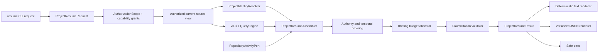

# Handoff 00 — CTO to Principal Engineer: Project Resume Planning Brief

| Field | Value |
|---|---|
| Sender | Chief Architect / CTO |
| Receiver | Principal Engineer |
| Milestone | v0.4 — Read-only Project Resume CLI Pilot |
| Date | 2026-07-27 |
| Status | **Architecture planning complete; implementation not authorized** |
| Repository | `AI-Operating-System` |
| Implementation branch | Not created or authorized |
| Implementation base | To be pinned only after v0.3.1 is accepted, released, and closed |
| Prerequisite | v0.3.1 Query Trust Contracts accepted and released |
| Required next gate | Chief of Staff validation and Product Owner implementation authorization after v0.3.1 closure |

## 1. Objective and planning disposition

v0.4 must deliver one narrow outcome: a user selects one project and receives a
deterministic, sourced, read-only briefing that makes it faster to resume meaningful work.
The briefing covers:

- objective and current authoritative status;
- current priorities and next action;
- accepted decisions;
- recent sessions;
- open tasks and questions;
- resources;
- authorized repository activity; and
- missing, stale, conflicting, or unavailable context.

Every material statement must bind to validated current-source evidence. Missing or
unavailable evidence must reduce coverage visibly rather than be converted into a fluent
unsupported claim.

**Planning disposition: READY FOR GOVERNANCE VALIDATION, NOT READY FOR IMPLEMENTATION.**

This artifact defines the intended architecture and implementation evidence. It grants no
authority to create a branch, modify product code, begin engineering, reuse the parked
conversation candidate, or perform live connector work. Implementation remains blocked
until v0.3.1 closes and the implementation base is pinned in a superseding authorized
handoff.

## 2. Authoritative inputs and precedence

The Principal Engineer must start from the project control index and then read these
artifacts in precedence order:

1. [Project Control and Handoff Index](../../coordination/README.md)
2. [v0.4 Project Resume Acceptance Tests](../../product/V0.4_PROJECT_RESUME_ACCEPTANCE_TESTS.md)
3. the final v0.3.1 Product Owner release decision and Librarian closeout, when available;
4. [ADR-0012 — Layered Deterministic Query Pipeline](../../adr/ADR-0012-Query-Engine-Is-A-Layered-Deterministic-Pipeline.md)
5. [ADR-0014 — Relevance and Answer Confidence](../../adr/ADR-0014-Retrieval-Relevance-Is-Separate-From-Answer-Confidence.md)
6. [ADR-0015 — Authorization Before Retrieval](../../adr/ADR-0015-Authorization-Precedes-Retrieval-And-Graph-Expansion.md)
7. [ADR-0016 — Passage/Revision Citations](../../adr/ADR-0016-Citations-Bind-Passages-To-Source-Revisions.md)
8. [ADR-0017 — Stable Source Identity](../../adr/ADR-0017-Stable-Source-Identity-Is-Separate-From-Location.md)
9. [Security Threat Model](../../reviews/SECURITY_THREAT_MODEL.md)
10. [Prototype Architecture](../../software/ARCHITECTURE.md)
11. [Dashboard PRD](../../prd/DASHBOARD.md), as non-binding context where it does not
    expand the accepted CLI-pilot scope;
12. [Project Turnover](../2026-07-27-JARVIS-PROJECT-TURNOVER.md).

The accepted v0.4 acceptance tests control release behavior. The Dashboard PRD does not
authorize a graphical dashboard, widget platform, operational settings store, or remote
JavaScript in v0.4.

## 3. Preconditions and implementation gate

Before engineering may begin, all of the following must be true:

1. v0.3.1 has a final Product Owner release decision and repository closeout.
2. The v0.3.1 trust-contract implementation is present on the selected v0.4 base.
3. The working tree is clean and the exact base commit is recorded.
4. A new v0.4 branch is created from that exact base; it contains no commits from
   `feature/v0.4-conversation`.
5. Chief of Staff validates this brief against the closed v0.3.1 repository state.
6. The Product Owner explicitly authorizes implementation.
7. The repository-activity decision in Section 15 is resolved.
8. Any required new ADRs are accepted before code that depends on them.

Until then, permitted work is limited to architecture review, fixture design on paper,
test planning, and documentation refinement.

## 4. Target architecture

Project Resume is an application service over the accepted v0.3.1 read-only query and
trust pipeline. It is not a second search engine and must not bypass authorization,
current-source validation, graph confinement, or context budgeting.



The required dependency direction is:

```text
CLI/renderers
    -> Project Resume application service
        -> identity, authority, budget, and result contracts
        -> v0.3.1 query/repository ports
        -> optional read-only repository-activity port
```

The Project Resume layer may compose accepted query components, but it must not reach
around `QueryEngine` into an unrestricted global note list for request-visible selection
or graph expansion.

## 5. Proposed package and responsibility boundaries

The exact filenames may change during Chief of Staff validation, but responsibilities must
remain separated:

```text
src/jarvis_core/project_resume/
    request.py       immutable request, budgets, authorization and capability grants
    identity.py      exact/ambiguous/missing project resolution
    authority.py     authority class, status precedence, temporal fit, conflicts
    assembler.py     orchestration only
    budget.py        deterministic section allocation and omission accounting
    results.py       versioned briefing, claim, evidence, limitation and trace contracts
    render.py        deterministic text and JSON rendering
    repository.py    read-only RepositoryActivityPort and value objects
```

Existing parser, note models, repository discovery, authorization, relationships, query
ranking, citation validation, and tracing remain owned by their current layers. Do not
copy their logic into `project_resume`.

## 6. Request and authorization contract

The proposed immutable request contract is:

```text
ProjectResumeRequest
  request_id
  workspace_id
  project_selector
  authorization_scope
  source_root
  context_budget
  output_budget
  repository_activity_grant
  trace_requested
  contract_version
```

Rules:

1. `authorization_scope` and a valid current `source_root` are mandatory.
2. Project selection occurs only over the authorized current-source view.
3. Repository activity is denied unless an explicit request-scoped read grant is present.
4. Unknown policy, malformed scope, duplicate canonical IDs, or indeterminate
   sensitivity fails closed.
5. Excluded identities and content may not influence candidate lists, ordering, graph
   traversal, briefing claims, conflicts, omissions, trace, or error details.
6. Safe aggregate counts may be emitted only where ADR-0015 permits them.
7. Request IDs are caller-supplied or deterministically derived outside byte-identical
   result assertions; no hidden randomness may enter structured output.

## 7. Exact project identity

`ProjectIdentityResolver` operates only on authorized notes with `type=project`.

Selection precedence:

1. exact workspace-scoped canonical `source_id`;
2. exact normalized title;
3. exact normalized alias;
4. exact normalized filename stem, labeled as weaker path-derived identity.

Normalization may trim surrounding whitespace and apply the accepted case behavior. It
must not use fuzzy, prefix, substring, semantic, or relevance-ranked matching to silently
choose a project.

Outcomes:

- **selected:** exactly one canonical project identity;
- **ambiguous:** two or more matches at the same accepted identity tier; return safe
  candidates only, ordered by stable source identity;
- **not_found:** no match; do not substitute a related project;
- **invalid:** duplicate explicit IDs or malformed identity; fail closed.

Safe ambiguous candidates may contain only already-authorized display title, stable ID,
and current relpath. They contain no snippets, relationship details, restricted counts, or
ranking signals.

## 8. Briefing and claim contract

The proposed versioned result is `project-resume-result/0.4.0`:

```text
ProjectResumeResult
  contract_version
  request_id
  project_identity
  status: complete | partial | ambiguous | not_found | policy_error | failed
  sections[]
  citations[]
  conflicts[]
  omissions[]
  limitations[]
  coverage
  trace?
```

Each section contains typed, ordered `BriefingClaim` values:

```text
BriefingClaim
  claim_id
  section
  text
  statement_kind: fact | inference | unknown
  authority_class
  temporal_state: current | stale | undated | unavailable
  evidence_ids[]
  support: supported | incomplete | conflicting
```

Every material `fact` requires at least one current, validated v0.3.1 passage-and-revision
citation. An inference must name its supporting evidence and be visibly labeled. An
unknown is a limitation, not a negative factual assertion.

Claims whose only evidence is stale, missing, deleted, inaccessible, outside the current
root, or invalid after discovery cannot be `supported`. The renderer must not turn an
incomplete reference into a passage citation.

## 9. Required briefing sections

The deterministic section order is:

1. **Project** — canonical identity, objective, lifecycle status, priority, milestone.
2. **Current state** — authoritative status and “resume here” evidence.
3. **Next action and priorities** — explicit current source statements only.
4. **Accepted decisions** — accepted decisions before proposals/drafts.
5. **Recent sessions** — newest valid sessions first, labeled as historical context.
6. **Open tasks and questions** — explicit unresolved items; missing data remains unknown.
7. **Resources** — canonical references and freshness.
8. **Repository activity** — only when explicitly authorized and available.
9. **Conflicts, staleness, and missing context** — visible, never silently reconciled.
10. **Evidence coverage and omissions** — answer-level support and budget/dependency gaps.

Empty sections render a deterministic “no supported evidence available” state. They must
not claim that no task, decision, question, or activity exists.

## 10. Authority, conflict, and temporal ordering

Authority is explicit, typed, and independent of retrieval relevance.

Default precedence within the same subject:

1. accepted decision or explicitly authoritative project state;
2. current project dashboard/current-state passage;
3. explicit current task or priority metadata/passage;
4. recent completed session summary;
5. older session summary;
6. draft/proposed discussion;
7. inferred relationship or weak fallback identity.

Within one authority class, use effective date or source `updated` date descending, then
stable source identity and locator ascending. Undated evidence sorts after dated evidence
in the same class.

An older high-authority accepted decision is not overridden by a newer draft. A later
accepted decision may supersede an earlier accepted decision only when the evidence
explicitly establishes the same subject or a supersession relationship. Otherwise both
are shown as a conflict.

The system must not infer “current” from retrieval rank alone. Conflicts, staleness, and
temporal uncertainty are result data and visible output.

## 11. Retrieval and relationship strategy

Project Resume starts with the exact selected project, not a free-text best match.
Authorized evidence may be assembled from:

- typed `projects` metadata that resolves to the selected stable identity;
- authorized outgoing and incoming project relationships;
- explicit links from the canonical project dashboard;
- query results whose material retrieval signal binds to the selected project and whose
  current passage validates; and
- authorized repository activity through the separate port.

Every channel must return typed provenance describing why it selected the source. Graph
and relevance channels remain distinct. The assembler deduplicates by stable source
identity and current fingerprint; it does not merge conflicting revisions or duplicate
explicit IDs.

Cycles terminate through a visited set keyed by stable identity plus revision. Expansion
depth, candidate count, and per-channel limits are configuration-bound and reported as
safe omissions.

## 12. Budget architecture

Project Resume has two hard budgets:

- **evidence/context budget:** all selected passages and their wrappers before rendering;
- **output budget:** the complete text or JSON briefing, including labels, headings,
  citations, limitations, separators, and trace when requested.

Budgeting occurs before final emission and uses the same deterministic accounting unit as
the accepted v0.3.1 contract. No oversized first item may exceed either budget.

Allocation order:

1. reserve fixed wrapper, coverage, limitation, and citation overhead;
2. reserve minimum space for Project, Current state, and Evidence coverage;
3. allocate remaining budget by section priority;
4. select claims within sections by authority, temporal fit, then stable identity;
5. stop deterministically and record section/reason omission aggregates.

Trace has its own bounded allowance or is rejected when it cannot fit the configured
output contract. It may not silently make the ordinary briefing exceed its hard limit.

## 13. Trace and determinism

For identical source bytes, scope, request, connector snapshot, and configuration, the
structured result and citations must be byte-identical.

The safe trace includes:

- request ID;
- aggregate vault/source snapshot fingerprint;
- Project Resume, query, citation, trace, policy, and index contract versions;
- safe authorization-rule/version summary;
- selected authorized project identity;
- selected authorized evidence identities and locators;
- channel and authority reasons;
- conflicts, limitations, and safe omission aggregates;
- repository-activity snapshot identity when granted;
- per-stage timings in a non-deterministic diagnostics field excluded from
  byte-identical semantic-result assertions.

Trace must never contain excluded source IDs, paths, titles, excerpts, relationship
targets, conflict details, or error text.

## 14. Repository activity and degraded dependencies

Define a read-only `RepositoryActivityPort`:

```text
load_activity(project_id, repository_ref, authorization_grant)
    -> RepositoryActivitySnapshot | RepositoryActivityUnavailable
```

The snapshot has a stable snapshot/revision identity, observed-at metadata, bounded
activity items, and provenance. It exposes no write method.

For v0.4 planning:

- a deterministic fixture adapter is required for automated evidence;
- a read-only local Git adapter may be implemented if the pinned base already provides
  an approved safe subprocess/filesystem boundary;
- live GitHub access is **not authorized by this brief**;
- a live GitHub adapter requires an explicit Product Owner scope decision, documented
  permissions, egress/privacy review, credential handling, rate-limit and timeout policy,
  and new security tests.

Unavailable, unauthorized, timed-out, malformed, or stale repository activity returns a
typed limitation. It must not block safe local-vault completion, retry indefinitely, or
be represented as “no activity.”

## 15. Unresolved decision

| Decision | Owner | Blocking impact | CTO recommendation |
|---|---|---|---|
| Whether v0.4 pilot repository activity is fixture/local-Git only or includes live GitHub reads | Product Owner, advised by CTO and Security | Blocks implementation of any live network adapter, not the local Project Resume core | Use fixture plus local read-only Git in v0.4; defer live GitHub to a separately authorized connector milestone unless pilot value cannot be tested without it |

This decision must be recorded before the implementation authorization package is issued.

## 16. Compatibility and migration

1. Build on the released v0.3.1 contracts without weakening them.
2. Do not consume the v0.3 legacy reader as the normal Project Resume path.
3. Introduce new Project Resume contracts additively under
   `project-resume-result/0.4.0`.
4. Keep existing supported query CLI behavior unchanged.
5. Add `jarvis resume <project-selector>` as a separate command with text and JSON output.
6. Do not rename or reuse the parked `jarvis chat` implementation as Project Resume.
7. Do not cherry-pick the parked `feature/v0.4-conversation` branch.
8. Any required vault-schema change must be optional/read-compatible and separately
   approved; v0.4 cannot write migrations into the vault.

Recommended ADRs before implementation:

- Project Resume identity and ambiguity semantics;
- Project Resume authority/temporal/conflict ordering;
- Project Resume claim, coverage, and budget contract;
- repository-activity port and capability boundary if live access remains in scope.

## 17. Requirement-to-evidence matrix

| Acceptance | Required implementation evidence |
|---|---|
| A1 exact selection | Unit/fixture tests for canonical ID/title/alias/stem tiers; all required sections; claim-level passage/revision citations |
| A2 ambiguous/missing | Equal-tier collisions, duplicate IDs, safe candidate fields, no fuzzy substitution |
| A3 authorization | Pre-selection filtering; restricted project/evidence/repository activity; non-disclosure across result, conflict, omission, error, graph, timing, and trace |
| A4 current ordering | Accepted-versus-draft, current dashboard-versus-old session, later accepted supersession, unresolved material conflict |
| A5 citation inspection | Exact bytes, locator, hierarchy, excerpt, mutation, deletion, unavailable source, metadata-derived claim |
| A6 budgets | Empty, exact-boundary, one-over, oversized-first, multibyte, cycles, high fan-out, wrapper/separator/citation/trace accounting |
| A7 read-only | Before/after hashes, inventory, metadata, Git status, external mock, no durable state; explicit non-vault output only |
| A8 determinism/trace | Byte-identical structured output; contract/index/policy/source fingerprints; safe trace; timing isolation |
| A9 degradation | Connector denied/unavailable/timeout/malformed/stale; local briefing succeeds partial; no retry loop |
| A10 performance | Both pilot vaults under 30 seconds; retrieval p50/p95/p99 and total p50/p95/p99; source and omission counts |
| A11 user value | Versioned dogfood event schema and eight-week scorecard; no vault write; claim-level defect review |
| A12 packaging/recovery | Clean supported environment, both pilots, rebuild derived state, corrupt/missing-index recovery, unchanged canonical sources |

## 18. Required fixtures

At minimum, add deterministic fixtures for:

- exact canonical project ID;
- exact title, alias, and path-fallback identity;
- same-title and same-alias ambiguity;
- duplicate explicit project IDs;
- missing project;
- restricted project and restricted linked evidence;
- accepted decision versus newer draft;
- two accepted conflicting decisions;
- stale dashboard versus newer authoritative state;
- current and old session summaries;
- explicit open tasks/questions and absent task data;
- oversized project, high fan-out, and graph cycle;
- changed/deleted/symlink-escaped supporting source;
- authorized repository activity;
- denied, unavailable, timed-out, malformed, and stale repository activity;
- prompt-injection text embedded in a source note.

Fixture assertions must not depend on the two real pilot vaults. Pilot-vault evidence is a
separate release layer.

## 19. Security review matrix

Engineering and QA must cover:

1. selector injection and pathological Unicode;
2. path traversal, separator variance, symlink/junction escape, and case boundaries;
3. project-title/alias collisions and duplicate IDs;
4. sensitivity and workspace-scope bypass;
5. excluded-term influence on ranking and ordering;
6. excluded identities in ambiguity, conflicts, trace, errors, omissions, and timing;
7. prompt injection treated strictly as untrusted source data;
8. stale/current-source race and post-discovery mutation;
9. connector credential, permission, egress, timeout, and error redaction if live access is
   separately authorized;
10. non-vault output confinement and overwrite behavior;
11. denial-of-service through cycles, fan-out, huge notes, huge metadata, or connector
    pagination;
12. deterministic termination under every budget and dependency failure.

## 20. Performance and operational gates

Required metrics:

- discovery/parsing;
- authorized-view construction;
- exact identity selection;
- retrieval;
- graph expansion;
- authority/conflict ordering;
- citation/current-byte validation;
- repository activity, when granted;
- rendering;
- total latency;
- peak memory;
- authorized and omitted source counts.

Release gate:

- total completion under 30 seconds for each pilot vault on documented reference hardware;
- retrieval p50/p95/p99 and total p50/p95/p99 reported separately;
- at least 30 measured runs after documented warm-ups for synthetic repeatability;
- cold and warm pilot results labeled separately;
- connector-disabled and degraded-connector results included;
- no performance optimization may weaken authorization, current-source validation,
  citation coverage, deterministic budgeting, or read-only behavior.

## 21. User-value and dogfood evidence

Define a versioned, append-only evaluation record outside canonical pilot vaults:

```text
ProjectResumeDogfoodEvent
  event_id
  project_id
  candidate_version
  started_at
  useful_orientation_seconds
  outcome: successful | abandoned
  estimated_minutes_saved
  rated_useful: yes | no | unrated
  incorrect_or_missing_context_count
  citation_defect_count
  correction_minutes
  metadata_minutes
  requested_features[]
```

The event store is evaluation evidence, not durable conversation memory and not a product
write capability. Its destination and consent must be explicit. If that boundary is not
approved, collect the scorecard manually outside Jarvis for the v0.4 pilot.

Advancement requires eight weeks of evidence and at least 80% useful among rated
briefings. The strategic targets remain 15–30 minutes saved per meaningful switch and
90–95% correctly sourced material claims.

## 22. Documentation and packaging deliverables

Engineering must produce:

- Project Resume CLI usage and examples;
- text and JSON contract documentation;
- identity and ambiguity rules;
- authority, temporal, conflict, coverage, and budget semantics;
- repository-activity capability/degradation documentation;
- trace field and redaction documentation;
- installation and diagnostic steps for a non-author;
- derived-index rebuild and corrupt/missing-index recovery;
- pilot procedure for AI Operating System and Cloud Organizer Pro;
- dogfood scorecard instructions;
- benchmark protocol and raw evidence;
- architecture diagram and dependency direction;
- release notes that identify Project Resume as v0.4 and visible-context chat as v0.5.

## 23. Explicit exclusions and forbidden work

v0.4 excludes:

- visible-context or multi-turn chat;
- the parked conversation implementation;
- real provider generation or provider streaming;
- durable conversation state or proposed memory;
- vault writes or metadata repair;
- embeddings, vector databases, persisted semantic indexes, or hybrid retrieval;
- plugins or MCP;
- agents, tools, actions, workflows, automation, watchers, or background services;
- dashboard UI/widget implementation;
- mobile, voice, team, enterprise, or marketplace work;
- arbitrary remote code;
- live GitHub or other network access unless separately authorized as described above.

Do not perform “helpful” schema migration, write canonical IDs, resolve links, update
project dashboards, or store generated briefings in the vault.

## 24. Definition of Done

Implementation is complete only when:

1. A1 through A12 pass with traceable evidence.
2. Every material claim has valid current passage/revision support or is visibly
   incomplete/conflicting.
3. Exact, ambiguous, missing, and invalid identities are deterministic and fail safely.
4. Authorization precedes every project selection, retrieval, graph, and connector path.
5. Context and output budgets are hard invariants.
6. Same-input structured results are byte-identical.
7. Connector failure cannot prevent safe local completion.
8. Both pilot vaults complete under 30 seconds on the documented reference machine.
9. Full tests, Ruff, mypy, packaging, `git diff --check`, read-only inventory, and
   benchmark checks pass.
10. A non-author completes installation, both pilot briefings, diagnostics, rebuild, and
    recovery.
11. Engineering reports all deviations, debt, evidence gaps, and unresolved risks.
12. Independent CTO conformance review clears the exact HEAD before QA begins.
13. Quality & Release independently executes the accepted matrix.
14. The Product Owner makes the final release decision.

A11's eight-week product-value gate may complete after technical candidate construction,
but v0.4 must not be declared strategically validated or used to justify v0.5 advancement
until that evidence is complete.

## 25. Required engineering handoff after authorization

When implementation is eventually authorized and completed, produce:

```text
docs/handovers/v0.4/02-principal-engineer-to-cto-engineering-review.md
```

It must contain:

- exact branch, base, HEAD, and full diff range;
- requirement/acceptance mapping;
- changed contracts and versions;
- architecture and security analysis;
- tests, static checks, unchanged-vault evidence, packaging evidence, and raw benchmarks;
- both pilot-vault results;
- repository-activity mode and grants;
- compatibility and migration evidence;
- known defects, deviations, debt, and waivers;
- exact follow-up review scope.

The preceding Chief of Staff authorization package should use:

```text
docs/handovers/v0.4/01-chief-of-staff-to-principal-engineer-implementation-authorization.md
```

That artifact does not exist yet and must not be created as an authorization until the
gates in Section 3 are satisfied.

## 26. Required next actions

### Chief of Staff

1. Hold this brief in planning state while v0.3.1 remains open.
2. After v0.3.1 closeout, validate every referenced contract against the merged code.
3. Resolve any base or artifact contradictions.
4. Route the repository-activity decision to the Product Owner.
5. Return the validated package to the CTO if the merged base requires architecture
   changes.

### Product Owner

1. Decide the v0.4 repository-activity scope.
2. After v0.3.1 closeout and Chief of Staff validation, explicitly authorize or return
   v0.4 implementation.

### Principal Engineer

Do not begin implementation. After receiving a valid authorization package, independently
verify its exact base, scope, exclusions, contracts, and acceptance matrix before changing
code.

## Exit statement

**Architecture planning is complete and ready for governance validation. Implementation is
blocked.** Project Resume remains v0.4; visible-context chat remains v0.5. No implementation
branch, base commit, or engineering authorization exists until v0.3.1 is accepted, released,
and closed and the Product Owner grants explicit v0.4 implementation authority.
