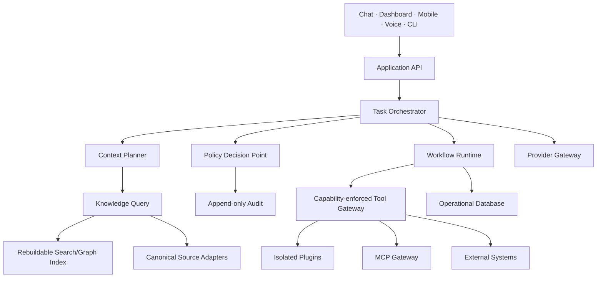

# Enterprise Architecture Review

| Field | Value |
|---|---|
| Purpose | Audit v0.1 and identify decisions required for a decade-scale platform |
| Status | Draft review |
| Version | 1.0.0 |
| Owner | Principal Systems Architect |
| Revised | 2026-07-27 |
| Reviewed baseline | Jarvis Core v0.1.0 on GitHub `main` |

## Executive assessment

v0.1 is an unusually disciplined prototype: small, typed, deterministic, read-only, and tested. Its strongest choice is not Python or Markdown; it is the refusal to mix knowledge authority, parsing, relationship resolution, context assembly, and provider behavior.

It is not yet a platform architecture. Several current protocols are deliberately minimal and will become liabilities if extended incrementally without new boundary contracts. Before network providers, writes, agents, or plugins, the project must define identity, policy, event, artifact, provenance, and operational-state models.

## Strengths

- **Read-only by construction:** the repository protocol exposes no write method and tests hash trees before/after execution.
- **Deterministic packages:** stable sorting and serialization enable snapshots, caching, evaluation, and reproducible debugging.
- **Failure containment:** malformed notes become parse/validation issues instead of aborting a scan.
- **Replaceable seams:** repository and provider protocols isolate filesystem and model adapters.
- **Human-readable authority:** Markdown/YAML remains usable without the application.
- **Explicit deferrals:** known limitations and deferred decisions reduce accidental architecture-by-code.
- **Good prototype economics:** standard library plus PyYAML, CLI-first, no premature services.

## Weaknesses and technical debt

| Finding | Severity | Reason and recommendation |
|---|---|---|
| `Provider.summarize()` is too narrow | High | Agents/chat need messages, structured output, streaming, tool proposals, usage, cancellation, and capability negotiation. Replace with a versioned request/event protocol before real adapters. |
| `KnowledgeRepository` conflates discovery and parsed domain access | High | Million-note scale needs source enumeration, revision cursors, partial reads, query/index interfaces, and snapshot consistency. Preserve the current adapter, but introduce separate SourceStore and KnowledgeQuery ports. |
| Identity is name/alias/stem based | High | First-writer-wins can silently choose the wrong note. Require stable IDs, collision reports, and explicit disambiguation; never resolve ambiguous identity deterministically without warning. |
| Context is one-hop and project-specific | Medium | Useful now, but future task context needs policy-scoped graph traversal, budgets, ranking, temporal filters, and explanations. Keep `ContextPackage` immutable; define a general ContextPlan. |
| No explicit trust labels on content | Critical before cloud | Sensitivity exists conceptually but is not enforced at source, chunk, package, provider, or output boundaries. Build mandatory information-flow labels. |
| Validation is not schema-complete | Medium | Pragmatic validation is appropriate for v0.1; publish schemas and compatibility behavior before automated writes. |
| Local filesystem snapshot is not transactional | Medium | Files may change during large scans. Record revisions and detect inconsistent snapshots; later support journaled/incremental indexing. |
| CLI orchestration owns composition | Medium | A service/application layer is needed before multiple interfaces; avoid importing CLI assumptions into API design. |

## Scalability concerns

### Millions of notes

Full discovery and parse per request cannot scale. Required changes:

- incremental ingestion based on stable path plus content hash;
- append-friendly source revision journal;
- SQLite FTS for personal scale, with an interface allowing a different index later;
- chunk and entity projections linked to source revisions;
- context budgets that prevent graph explosions;
- benchmark datasets for latency, memory, precision, and rebuild time.

Do not move canonical notes into a database to solve indexing. Scale the projection layer.

### Thousands of plugins

A registry imported into the core process will not be safe or operable. Plugins require out-of-process isolation, declarative manifests, capability grants, quotas, health states, compatibility testing, revocation, and ecosystem governance. “Thousands installed simultaneously” should not be a goal; design for thousands available and a small bounded active set.

### Many agents

Agents should not be long-lived personalities sharing unrestricted memory. They are versioned policies and prompts operating on a task, capability grant, context snapshot, and budget. A supervisor cannot be the only safety control; enforcement belongs below every agent at tool and data boundaries.

## Maintainability concerns

- Keep domain models free from Pydantic/web framework coupling.
- Publish schema versions and migration rules before external consumers exist.
- Split product documentation, platform contracts, and implementation notes to avoid contradictory “architecture” documents.
- Establish an ADR supersession process and decision matrix.
- Assign owners to contracts, not just documents.
- Add compatibility fixtures from every supported schema version.

## Security concerns

The current read-only prototype has a small attack surface. The threat surface changes discontinuously—not gradually—when adding:

- cloud providers receiving vault text;
- HTML/Markdown rendering;
- external content carrying prompt injection;
- secrets and OAuth refresh tokens;
- plugin/MCP code or remote tools;
- vault writes and filesystem actions;
- background triggers;
- mobile/remote access.

Each is a security milestone, not an ordinary feature. See [Security Threat Model](SECURITY_THREAT_MODEL.md).

## Simplification opportunities

1. Keep one core `Artifact`/`SourceRef` envelope rather than feature-specific provenance formats.
2. Use one capability/permission vocabulary for native tools, plugins, MCP, agents, and automation.
3. Use one event envelope and audit schema across workflows.
4. Treat agents as configured task executors on the same orchestration runtime, not separate frameworks.
5. Treat chat, dashboard, mobile, and voice as clients of the same application API.
6. Avoid a bespoke vector database until SQLite/hybrid benchmarks prove it necessary.
7. Do not build both a plugin protocol and an MCP protocol at the same boundary; plugins extend Jarvis, MCP exposes/imports tools through a gateway.

## Decisions required before more coding

1. Stable entity identity and ambiguity semantics.
2. Context Package v1 ownership and compatibility.
3. Information-flow sensitivity labels and provider egress policy.
4. Capability-based permission model and approval lifecycle.
5. Operational database/event/audit schema.
6. Plugin isolation boundary and MCP gateway boundary.
7. Atomic write, backup, conflict, and rollback protocol.
8. Search projection interface and benchmark targets.

## Recommended target architecture

Policy enforcement points must exist at source read, context assembly, provider egress, tool invocation, result ingestion, and durable write.

## Revision history

| Version | Date | Change |
|---|---|---|
| 1.0.0 | 2026-07-27 | Initial enterprise architecture audit of v0.1 |
