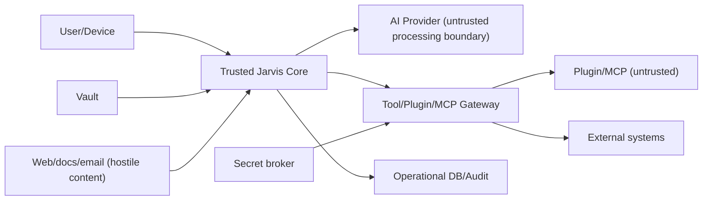

# Security Threat Model

| Field | Value |
|---|---|
| Purpose | Identify assets, trust boundaries, threats, mitigations, and release gates |
| Status | Draft security review |
| Version | 1.0.0 |
| Owner | Security Architecture |
| Revised | 2026-07-27 |
| Scope | Personal local-first deployment through planned v1.0 |

## Security objectives

1. Preserve confidentiality and integrity of vault knowledge and secrets.
2. Ensure no consequential action occurs without valid authority.
3. Prevent untrusted content, models, plugins, or remote services from escalating privilege.
4. Maintain attributable, recoverable operations.
5. Fail safely when policy, identity, source freshness, or system health is uncertain.

## Assets

- vault notes, attachments, metadata, and backups;
- conversations, context packages, preferences, and operational history;
- API keys, OAuth tokens, encryption keys, and device credentials;
- source code, CI credentials, packages, and releases;
- permissions, approvals, policies, plugin grants, and audit records;
- external systems reachable through tools;
- user identity, contacts, financial data, calendar, email, and occupancy data.

## Trust boundaries

Content is not trusted because it is local. A vault note, repository README, email, website, MCP description, tool output, or model response may contain malicious instructions.

## Threat actors

- opportunistic malware or another local user;
- malicious or compromised plugin/MCP publisher;
- compromised dependency, CI account, update server, or provider;
- attacker controlling a document, website, email, repository, or calendar invite;
- stolen device/token;
- malicious insider in a future team deployment;
- confused or overconfident AI acting beyond intent;
- accidental user misconfiguration.

## Threat register

| ID | Threat | Impact | Priority | Required mitigation |
|---|---|---|---|---|
| T01 | Vault exfiltration to provider/plugin | Critical | P0 | Sensitivity labels, egress PDP, scoped reads, redaction, audit |
| T02 | Prompt injection in retrieved content | Critical | P0 | Treat content as data, instruction hierarchy, tool isolation, injection tests |
| T03 | Plugin/MCP arbitrary code or capability escalation | Critical | P0 | Out-of-process isolation, manifests, grants, brokered I/O, signing/revocation |
| T04 | Secret leakage in prompts/logs/errors | Critical | P0 | OS secret store, opaque handles, audience binding, redaction scanners |
| T05 | Unauthorized vault mutation | Critical | P0 | Separate read/write ports, diff approval, expected hash, atomic write, backup |
| T06 | Approval spoofing/replay | High | P0 | Bind approval to user, action digest, target revision, scope, expiry, device |
| T07 | Supply-chain compromise | Critical | P0 | Locked deps, SBOM, provenance, reviews, signed releases, minimal dependencies |
| T08 | Cross-workspace/client leakage | Critical | P0 | Mandatory workspace scope, separate keys/indexes, deny-by-default tests |
| T09 | Malicious model/tool output rendered as active content | High | P0 | Sanitization, safe Markdown, no remote scripts, explicit links/downloads |
| T10 | Index/cache leaks deleted/restricted content | High | P0 | Source-revision tombstones, sensitivity filtering, deletion/rebuild tests |
| T11 | Background job performs stale/duplicate effect | High | P1 | Idempotency, reauthorization, preconditions, effect receipts, reconciliation |
| T12 | Audit tampering or excessive sensitive logging | High | P1 | Append-oriented log, integrity controls, redaction, access/retention policy |
| T13 | Remote/mobile gateway compromise | Critical | P1 | No direct vault exposure, device trust, revocation, E2E protections |
| T14 | Denial of service via huge/cyclic content | Medium | P1 | Size, depth, time, memory, rate and concurrency limits |
| T15 | Backup exposure or failed restoration | High | P1 | Encryption, least access, hash verification, restore drills |

## Vault privacy

- Default to local processing for unrestricted vault scans.
- Assign sensitivity at workspace/source/note/chunk; inheritance is conservative.
- Provider dispatch uses the most restrictive included label.
- Exclude raw Conversations, personal profiles, secrets, financial/client, and system state from general context by default.
- Context preview shows every source and planned destination.
- Backups receive at least the vault's sensitivity and must not sit inside the live vault.
- Deletion documents residual copies in backups and providers.

## Prompt injection controls

1. Separate trusted system/developer policy from user requests and retrieved content.
2. Mark source boundaries in context; never concatenate raw content as privileged instruction.
3. Models may propose tool calls; the host independently validates identity, arguments, capability, sensitivity, and approval.
4. Strip/neutralize active HTML, remote images, data URLs, and executable attachments in rendering.
5. Detect suspicious content for warning/risk scoring, but never rely on detection as the primary control.
6. Minimize content and tools available to each task.
7. Test indirect injection through Markdown, PDF/OCR, web, email, repository, MCP descriptions, and tool results.

## Secrets management

- Store secrets in OS credential store or dedicated broker, never Markdown, `.env` committed to Git, logs, plugin config, or model context.
- Pass opaque handles to adapters; bind use to provider/domain/audience.
- Separate development/test/production credentials.
- Rotate, revoke, and inventory credentials; show last use.
- OAuth scopes are least privilege and connector-specific.
- Crash reports and diagnostics redact before persistence/export.

## Permission boundaries

Policy is enforced at:

- source discovery/read;
- context selection;
- provider egress;
- tool/plugin/MCP invocation;
- external write;
- result ingestion/rendering;
- durable memory write;
- background scheduling/replay.

Permission decisions include actor, task, workspace, capability, resource scope, sensitivity, side-effect class, action digest, preconditions, expiry, and approval. Model statements never grant permissions.

## Read-only guarantee

Read-only mode is a runtime security property:

- process/adapter receives no write method or handle;
- writable directories are not mounted/granted;
- network disabled unless explicitly required;
- hash/metadata tests detect mutation;
- plugin and external tool systems are absent or separately read-only;
- “dry run” cannot call effectful tools.

Naming an option `read_only=True` is insufficient.

## Plugin and MCP security

- Third-party code runs outside core with OS-level restrictions.
- Network/filesystem/secrets require explicit capabilities.
- Updates cannot add capability silently.
- Inputs/outputs are schema, size, timeout, and injection checked.
- Publisher signing is combined with review, SBOM, advisories, and revocation.
- Plugin state and logs are namespaced; uninstall offers cleanup.
- MCP descriptions and server outputs are hostile data.

## Supply-chain security

- Pin direct/transitive dependencies with reviewed update automation.
- Generate SBOM and provenance for releases.
- Use protected branches, required CI, least-privilege workflow tokens, immutable action SHAs.
- Scan dependencies, secrets, licenses, and artifacts.
- Sign tags/releases/installers; publish hashes.
- Separate build and publish authorization; require human release approval.
- Keep dependency count low; evaluate maintenance and compromise history.

## Security testing

- SAST, dependency and secret scans on every PR.
- Property/fuzz tests for parser, schemas, paths, IPC, and permission decisions.
- Adversarial prompt/tool/plugin corpus.
- Sandbox escape and capability denial tests.
- Backup restoration and vault-write fault injection.
- Cross-workspace isolation tests.
- External penetration test before v1.0 and before enterprise/multi-user release.

## Incident response

Provide kill switches for provider, connector, plugin, agent, automation, and all writes. Preserve redacted audit evidence; rotate credentials; quarantine plugin/package; notify user of affected scope; restore trusted state; publish root cause and prevention. Never “repair” canonical knowledge automatically after compromise.

## Release security gates

| Capability | Gate |
|---|---|
| Cloud provider | Egress policy, secrets broker, context preview, injection tests |
| Vault write | Atomic transaction, hash precondition, backup/rollback, diff approval |
| Plugin/MCP | Isolation, capabilities, audit, conformance/adversarial suite |
| Background automation | Durable idempotency, reauthorization, kill switch, reconciliation |
| Mobile/remote | Device trust, revocation, gateway threat review, penetration test |
| Team/enterprise | Tenant model, identity, audit administration, data lifecycle review |

## Residual risks

AI outputs remain probabilistic; local device compromise can defeat application controls; external providers retain data under their policies; backups complicate deletion; signed plugins can still be malicious. The product must communicate these honestly.

## Revision history

| Version | Date | Change |
|---|---|---|
| 1.0.0 | 2026-07-27 | Initial comprehensive threat model |
