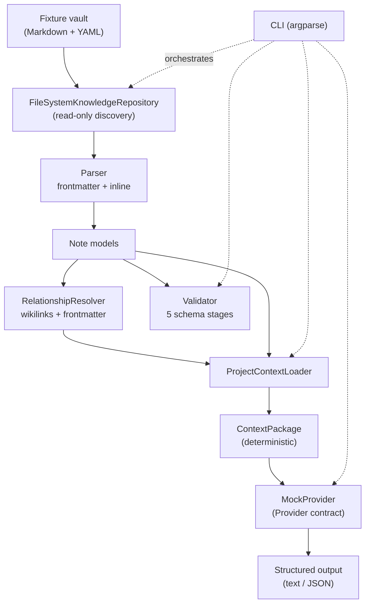

# Prototype Architecture

Jarvis Core is a small, layered, read-only pipeline. Each layer has one responsibility
and communicates through explicit typed contracts, so any layer can be replaced without
rewriting the others (SYSTEM_PRINCIPLES.md Principle 10).

## Data flow

## Components

- **config** — typed, immutable `Config` with safe defaults; the default input is the
  bundled sample fixture, and `.obsidian` (plus `.git`, `.smart-env`, …) is excluded.
- **models** — `Note`, entity views (`Project`, `Decision`, `Session`, `Resource`,
  `Concept`), `Link`/`AttachmentRef`, `ContextPackage`, and `ValidationResult`. Values
  mirror `VAULT_SCHEMA.md` and `schemas/note.schema.json`.
- **parsing** — `frontmatter.py` (YAML, with malformed-input reporting), `inline.py`
  (wikilinks, aliases, embeds, markdown links, tags, headings), `markdown_parser.py`
  (assembles a `Note`; never raises on content problems).
- **repositories** — `KnowledgeRepository` Protocol + `FileSystemKnowledgeRepository`.
  Application code depends on the Protocol, not on raw filesystem calls. Read-only by
  construction: there is no write method.
- **relationships** — `RelationshipResolver` builds a name index (id, title, aliases,
  stem) and resolves wikilinks and frontmatter arrays; unresolved references are
  reported, never repaired.
- **context** — `ProjectContextLoader` assembles the deterministic package;
  `validator.py` runs the five stages (syntax, shape, vocabulary, integrity, policy).
- **providers** — `Provider` contract, `MockProvider` (deterministic), and
  documentation-only placeholder adapters that raise `NotImplementedError`.
- **cli** — argparse front door with documented exit codes.
- **metrics** — `PerfReport` + `measure()` context manager for per-stage wall-clock
  timing (parse/resolve/validate/total). No global state.
- **health** — `analyze_vault()` runs seven read-only checks (missing frontmatter,
  duplicate IDs, orphans, broken wikilinks, invalid schemas, missing aliases, circular
  references via Tarjan SCC) into a `VaultHealthReport`, rendered as text or JSON.

## Determinism

Discovery sorts by relative path; links/attachments are sorted; the loader sorts
decisions by `(decision_date, id)`, sessions by `(session_date, id)` descending, and
resources/concepts by `(title, id)`. `ContextPackage.to_dict()` emits a fixed field
order with no timestamps or randomness, so identical inputs yield byte-identical output.

## Read-only safety

The repository opens files with mode `r` only. No component creates, edits, moves, or
deletes anything. A test (`tests/integration/test_readonly_safety.py`) hashes the entire
fixture tree before and after a full run and asserts it is unchanged, and that no files
were added or removed.
