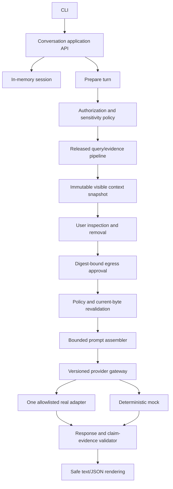

# v0.5 Visible-Context Conversation Architecture

| Field | Value |
|---|---|
| Status | Proposed — not implementation authority |
| Planning base | `main@1813f845a6d3250d33fd8f5862579b89dab03306` |
| Historical input | `feature/v0.4-conversation@4b09050b76fd9a448af3ce91b4aa66963d23dad2`, read-only |
| Proposed ADRs | ADR-0022 through ADR-0024 |

## Architecture outcome

Conversation is an application layer above the released deterministic query/evidence
pipeline. It owns temporary cross-turn state and provider orchestration but receives no
vault write port, operational-store port, tool gateway, or general network client.

The arrows from authorization through dispatch are one-way trust transitions. No provider
or renderer can request additional sources or mutate a snapshot.

## Component boundaries

### Conversation application API

Owns the versioned commands `create_session`, `prepare_turn`, `remove_context`,
`dispatch_turn`, `cancel_attempt`, `retry_attempt`, `inspect_history`, and `reset_session`.
The exact names are illustrative; Engineering must use one versioned contract. It accepts
typed values and returns typed outcomes. It does not expose provider-native payloads.

### In-memory session

Stores ordered turns, explicit entity focus, visible assumptions, snapshot digests,
attempts, normalized answers, usage, and safe trace events. Capacity is bounded by turns,
tokens, and bytes. Eviction is deterministic and visible. No process-exit persistence or
crash recovery is claimed.

### Prepare service

Validates the workspace and provider destination, freezes scope, performs authorization
before retrieval, and reuses released source identity, fingerprint, locator, evidence,
authority/conflict, and budget services. Project selection, if requested, uses ADR-0018.
Project Resume assembly is not invoked as a hidden conversation source.

### Context snapshot

`ContextSnapshot/v1` is an immutable semantic object containing:

- request, workspace, policy, destination, and model-role identities;
- normalized user input and visible reference-resolution assumptions;
- ordered evidence items and their ADR-0016 citations;
- sensitivity and selection reason per item;
- exclusions chosen by the user;
- context/prompt budget accounting and safe omissions;
- prompt-template, prompt-assembler, history-serialization, token-estimator,
  safety-instruction, and output-reserve versions, plus the output-reserve value;
- explicit evaluation time; and
- SHA-256 digest over canonical serialization, excluding diagnostics/timings.

Snapshots are not files and are not durable data. Context removal returns a new snapshot.

### Egress decision

`EgressApproval/v1` binds actor confirmation to the exact snapshot digest, destination,
role, policy version, every prompt-construction version, output reserve, and expiry. The
policy decision point is local and independent of the model. A denied or indeterminate
decision prevents prompt construction and adapter access.

### Prompt assembler

Builds one complete prompt only from the approved snapshot. The exact content-bearing
dispatch fields are deterministically derived from the snapshot's semantic inputs and bound
template, assembler, history, estimator, safety, and output-reserve versions. It uses fixed
trusted instructions and structurally delimited untrusted passages. Its hard budget includes
roles, history, source delimiters, citations, separators, safety instructions, and output
reserve. It never accepts provider/model instructions from source text.

### Provider gateway

Extends ADR-0010 with a versioned complete-response contract. The gateway is the only owner
of the approved network capability. Adapters declare endpoint and capabilities; the host
enforces an allowlisted destination, credential handle, timeout, size limits, cancellation,
and redaction. Content-bearing fields must exactly match the deterministic prompt/request
projection. Transport metadata uses a separate field allowlist, and authorization travels
through an opaque credential mechanism. Undeclared fields, telemetry, fallback routing, and
redirects are prohibited. Model identifiers remain configuration and evidence, not domain
identity.

The deterministic mock and one real adapter must pass the same behavior contract. Mock-only
evidence cannot prove egress, privacy, network failure, usage, or cost behavior.

### Response validator

Parses a normalized provider response, rejects malformed/oversized output, maps source
references only to snapshot evidence IDs, and builds claim records. It validates citation
currentness again before emission. It cannot fabricate citations, silently retarget stale
passages, or treat provider prose as evidence.

### Renderer and trace

Text and JSON share one semantic result. Supported citations, incomplete references, model
knowledge, conflicts, and limitations are structurally distinct. Trace is an event audit,
not chain-of-thought, and uses a safe field allowlist.

## Ordering invariants

For a remote turn, the only accepted order is:

1. validate request, workspace, destination, and immutable scope;
2. authorize sources before candidate generation/graph expansion;
3. retrieve and assemble bounded evidence;
4. validate current bytes and create snapshot;
5. display complete manifest;
6. apply user removals by creating a new snapshot;
7. obtain digest-bound approval;
8. re-evaluate policy and revalidate current bytes;
9. verify all bound prompt inputs and versions, then deterministically assemble the prompt;
10. dispatch through the one selected adapter;
11. validate response and claim support;
12. render result and append session state.

Failure at any step prevents later steps. A trace event cannot disclose data rejected by an
earlier step.

## Data ownership and write boundary

| Data | Owner | v0.5 behavior |
|---|---|---|
| Vault Markdown/YAML | User/vault | Read-only; byte and metadata integrity tested |
| Derived query structures | Jarvis | Rebuildable and sensitivity-scoped |
| Conversation session | Process | Volatile, bounded, resettable, not logged |
| Context snapshot/approval | Process | Immutable and volatile |
| Provider request/response | External provider under approved terms | Bounded; provider retention disclosed, Jarvis does not persist raw payload |
| Trace/diagnostics | Process/stdout | Redacted; no message or excerpt content by default |
| Durable memory | Vault after future approval | Not available in v0.5 |

The provider's own retention is an external residual risk and must be disclosed before
approval; “session-only” describes Jarvis storage, not a false promise about the provider.

## Failure and cancellation model

Each attempt has one terminal state. Policy blocks occur before dispatch. Timeouts and
cancellation close the adapter operation and produce no completed answer. If a provider
returns content but validation fails, the content is withheld and the attempt fails with a
redacted reason. There is no automatic fallback or retry. A user-triggered retry is a new
attempt under the same validated snapshot.

Offline/no-provider mode still supports preparation, context inspection, removal, and mock
fixtures. It does not pretend to deliver a real answer.

## Compatibility and migration

The historical conversation branch is not an ancestor implementation contract and has no
released data. v0.5 therefore starts with new contract versions and no transcript migration.
Reusable algorithms must be ported conceptually and reimplemented against released main,
not cherry-picked blindly.

Historical `confidence` fields are obsolete retrieval relevance and must not be read as
answer confidence. Historical note-level citations and post-completion stream events are
invalid. A compatibility reader is not recommended because there is no released consumer.

## Security posture

- deny by default at source, context, egress, adapter, rendering, and retry boundaries;
- no tool or write capability in the process graph;
- no provider call during prepare;
- no private data in errors, trace, logs, crash reports, or usage records;
- context and provider output remain hostile data;
- cross-workspace IDs, caches, snapshots, and sessions are isolated;
- hard limits cover content, graph traversal, history, prompt, response, time, memory, and
  concurrent attempts;
- provider endpoint, adapter version, policy version, and model configuration are evidence.

## Deferred architecture debt

Deferring persistence and streaming avoids debt rather than hiding it. The first deliberate
future seams are an encrypted conversation repository port and streaming event protocol.
Neither should be stubbed into v0.5. Reference resolution remains lexical/deterministic;
semantic resolution belongs with the later semantic-search decision.

## Architecture acceptance condition

This architecture remains proposed until the Product Owner decides every item in the
outgoing CTO disposition and the Chief of Staff validates exact resulting documents. It is
not an Engineering brief and does not authorize a branch or implementation.
