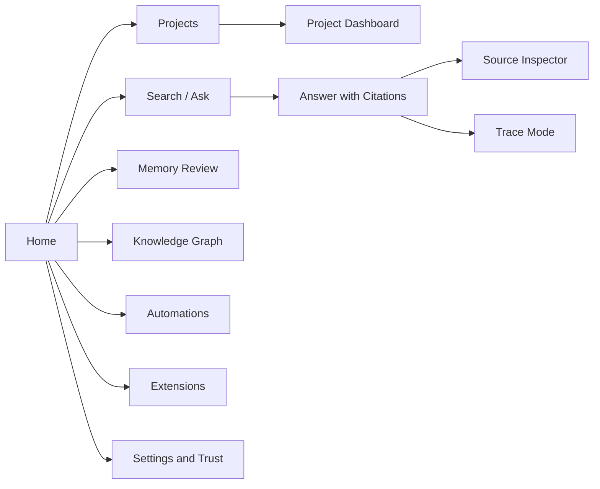

# UX and Interaction Specification

| Field | Value |
|---|---|
| Purpose | Define a coherent, trustworthy Jarvis experience across CLI, desktop, web, and mobile |
| Status | Proposed |
| Version | 1.0.0 |
| Owner | Product and Human Factors |
| Revised | 2026-07-27 |
| Related | [AI Behavior Standard](../AI_BEHAVIOR_STANDARD.md), [Product Vision](../PRODUCT_VISION.md), [Security Threat Model](../reviews/SECURITY_THREAT_MODEL.md) |

## Experience principles

1. **Evidence is part of the answer.** Citations are visible, inspectable, and never decorative.
2. **Read-only feels safe, not limited.** The interface distinguishes answers, proposals, and actions.
3. **Progressive disclosure prevents overload.** Start with the answer; expose sources, trace, and diagnostics on demand.
4. **Projects are the primary entry point.** Global search remains available, but a project dashboard supplies the normal working context.
5. **Uncertainty is legible.** Confidence labels explain evidence quality rather than implying mathematical certainty.
6. **The same mental model spans surfaces.** Search, citations, permissions, and memory proposals use consistent language everywhere.
7. **Accessibility is a release criterion.** Keyboard access, screen-reader semantics, contrast, reduced motion, and scalable text are required.

## Shared information architecture

Every surface MUST provide:

- a current workspace or project indicator;
- an obvious distinction between vault evidence and model-generated inference;
- a route from an answer to the exact cited note or resource;
- status for indexing freshness and unavailable providers;
- a safe escape or cancel path for long-running operations.

## Surface specifications

### CLI

**Primary users:** developers, automation authors, and keyboard-first users.

The CLI SHOULD optimize for composability and predictable output. Human-readable output is the default; `--json` provides a versioned machine contract. Commands that only retrieve information use verbs such as `search`, `ask`, `show`, and `trace`. Commands that propose or request changes use explicit verbs and never masquerade as reads.

Required interaction conventions:

- `jarvis ask` returns answer, confidence band, citation list, and request ID.
- `jarvis search` returns ranked results without synthesis unless requested.
- `jarvis trace <request-id>` exposes retrieval and policy events, not private chain-of-thought.
- Exit codes distinguish success, no result, partial result, invalid request, policy denial, and internal failure.
- Interactive prompts are disabled in automation mode.
- Secrets, full private note bodies, and hidden reasoning MUST NOT appear in logs.

### Desktop

**Primary users:** daily knowledge workers.

Use a three-pane layout: navigation, workspace, and contextual inspector. The workspace shows a dashboard, result list, or answer. The inspector shows sources, relationships, trace information, or a proposed memory change. Desktop integrations may open local folders or applications but MUST honor explicit permission boundaries.

Key behaviors:

- `Ctrl/Cmd+K` opens universal search and command palette.
- Project switching preserves drafts but never silently carries project context into a different project.
- Source preview highlights the cited passage and provides “Open in Obsidian.”
- Destructive or external actions appear in a separate approval surface with target, scope, and rollback information.

### Web

**Primary users:** remote access and administration.

The web experience mirrors desktop information architecture but assumes weaker access to local resources. Unavailable local actions are marked “requires desktop bridge” rather than failing ambiguously. Authentication, session expiry, CSP, and secure rendering of untrusted Markdown are mandatory.

### Mobile

**Primary users:** quick capture, review, and lightweight retrieval.

Mobile is a companion, not a compressed administrative console. Its initial scope SHOULD include:

- ask and search;
- citation viewing;
- project resume cards;
- inbox capture;
- memory-proposal approval or rejection;
- notifications for completed approved automations.

Plugin administration, bulk migration, and deep trace inspection SHOULD remain desktop/web tasks until a safe mobile design is proven.

## Core workflows

### Searching

1. User enters terms and optionally selects a project, date, note type, or source.
2. Results appear with title, excerpt, path, modified date, source kind, and match reason.
3. The user may refine filters without losing the query.
4. Exact search and semantic search are labeled separately when both contribute.
5. No-result states suggest broader terms and reveal excluded or stale indexes.

### Asking questions

1. The current scope is visible before submission.
2. Jarvis retrieves authorized evidence and displays progress stages.
3. The answer leads with the supported conclusion.
4. Citations appear adjacent to claims and in a source drawer.
5. Confidence and limitations follow the answer.
6. Suggested follow-ups are generated only when useful and remain non-executing.

### Viewing citations

A citation expands to show note title, stable identifier, path, passage, modified date, and retrieval reason. Users can open the original, copy a durable reference, or report a mismatch. If a source changed after answer generation, the interface warns that the answer may be stale.

### Graph navigation

The graph defaults to a focused neighborhood around the current note or project. Edge types and origin are explicit. Filters cover project, note type, relationship, date, and confidence. A graph edge proposed by AI is visually distinct from an authored link and cannot silently become durable knowledge.

### Memory review

Memory changes enter a review queue with:

- proposed statement;
- source evidence;
- destination and note type;
- affected links or metadata;
- reason and confidence;
- approve, edit, reject, defer, and “never suggest this” controls.

Approval creates an auditable change. Rejection does not punish future unrelated suggestions.

### Plugin management

The plugin page displays publisher, version, compatibility, requested permissions, data destinations, event subscriptions, health, and update history. Installation and permission expansion require explicit approval. A plugin can be disabled without deleting its configuration. Safe mode starts Jarvis without third-party plugins.

### Settings

Settings are grouped by Knowledge, Models, Privacy, Permissions, Search, Appearance, Notifications, and Diagnostics. Each setting explains scope and consequences. Export and reset operations state exactly what is included.

### Performance metrics

Users can inspect latency by stage, index freshness, retrieval count, token/cost estimate, cache status, and provider availability. Metrics MUST NOT imply answer quality solely from speed or model size.

### Trace Mode

Trace Mode is an evidence and execution audit, not a chain-of-thought viewer. It shows:

- normalized request and selected scope;
- retrieval queries and filters;
- returned source identifiers and ranks;
- provider and prompt-template versions;
- tool calls, permission decisions, and durations;
- output validation and citation checks;
- errors, retries, and fallbacks.

It MUST exclude secrets, private model reasoning, and unrelated source content.

## States and error recovery

| State | User-facing behavior | Recovery |
|---|---|---|
| Empty | Explain available actions with one useful example | Start search or open project |
| Loading | Show stage and allow cancellation | Cancel leaves prior state intact |
| Partial | Return supported material and name unavailable sources | Retry only failed stage |
| Stale index | Display last indexed time | Offer authorized refresh |
| No evidence | Say no supported answer was found | Broaden scope or identify missing source |
| Permission denied | Name blocked capability and reason | Open permission details |
| Provider unavailable | Preserve query and show fallback status | Retry or select provider |
| Citation mismatch | Suppress unsupported claim | Re-run retrieval or inspect trace |

## Human-factors requirements

- Never use color as the only indicator of confidence, risk, or state.
- Confirmations state the action and consequence, not merely “Are you sure?”
- Notifications are bundled and prioritized; informational events are silent by default.
- Response streaming must not present an unverified draft as final.
- The system must remain usable without graph visualization, mouse input, or animation.
- User studies SHOULD measure task completion, citation comprehension, false-confidence rate, and recovery from errors.

## Acceptance criteria

- A user can move from an answer to every supporting source in two interactions or fewer.
- Read-only, proposed, and approved actions are visually and semantically distinct.
- The four surfaces share terminology and confidence semantics.
- Trace Mode provides reproducible operational evidence without exposing chain-of-thought.
- All critical workflows are keyboard accessible and meet WCAG 2.2 AA targets.
- Usability tests show users correctly identify unsupported or low-confidence answers at least 90% of the time.

## Revision history

| Version | Date | Change |
|---|---|---|
| 1.0.0 | 2026-07-27 | Initial multi-surface interaction specification |
