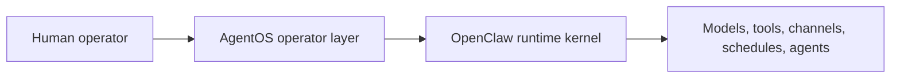
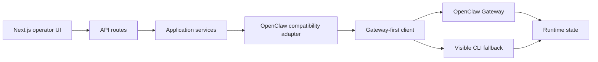
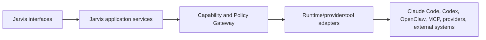
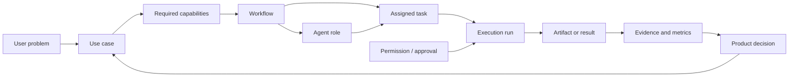
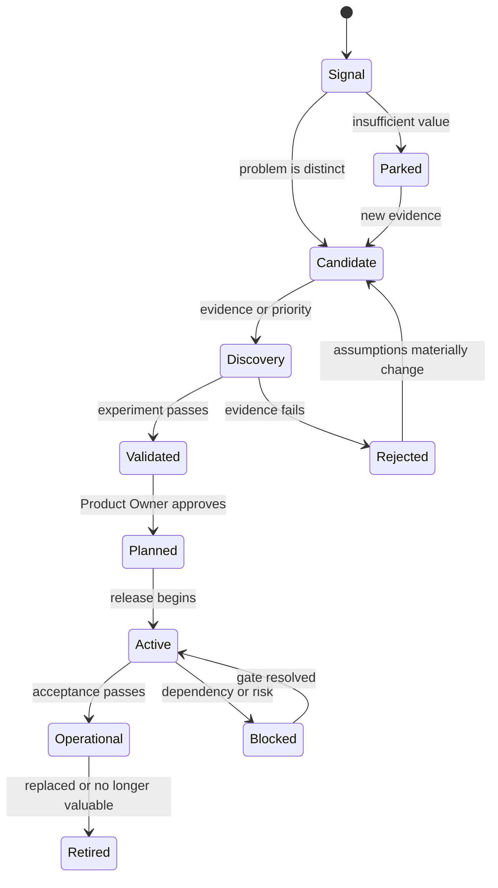
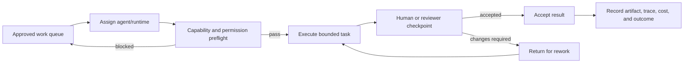

# AgentOS Architecture Review and Future Agent-Work Tracking Model

| Field | Value |
|---|---|
| Purpose | Evaluate SapienXai AgentOS as an architectural reference and define how Jarvis should track future use cases, agents, and work |
| Status | Research recommendation; not an adopted architecture decision |
| Version | 1.0.0 |
| Owner | Product and Architecture |
| Reviewed | 2026-07-28 |
| Source | [SapienXai/AgentOS](https://github.com/SapienXai/AgentOS) |
| Source version observed | AgentOS `0.7.6`; repository `main` |
| Related | [Agent Framework PRD](../docs/prd/AGENT_FRAMEWORK.md), [Automation Engine PRD](../docs/prd/AUTOMATION_ENGINE.md), [Plugin SDK](../docs/sdk/PLUGIN_SDK_SPECIFICATION.md), [System Principles](../docs/SYSTEM_PRINCIPLES.md) |

## Executive conclusion

AgentOS has meaningful overlap with Jarvis's long-term direction, particularly in:

- runtime and operator-layer separation;
- workspace-backed agent context;
- capability and compatibility discovery;
- visible execution state;
- diagnostics and release preflight;
- scheduled work;
- approvals and blocked capabilities;
- human oversight of persistent digital workers.

AgentOS should be treated as a **reference implementation for a future agent-operations layer**, not as Jarvis's kernel or immediate implementation foundation.

The products begin from different centers:

| Jarvis | AgentOS |
|---|---|
| Knowledge-first personal AI operating system | Agent-first digital-workforce control plane |
| Obsidian/The BRAIN is durable knowledge | OpenClaw is the execution runtime and state authority |
| Read-only retrieval and Project Resume first | Workers, missions, schedules, channels, browser accounts, and execution already present |
| Provider/runtime replacement is a core principle | OpenClaw is the explicit runtime dependency |
| Progressive trust: read, propose, approve, automate | Operational autonomy with explicit control and unsupported boundaries |

AgentOS validates several Jarvis architectural principles. It does not justify accelerating Jarvis into agents before Project Resume, evidence quality, permissions, and the Capability Gateway are proven.

## Scope and limitations

This is an architectural and product-pattern review based on:

- the repository README and published repository structure;
- security and operations claims documented by AgentOS;
- visible testing, release, installer, adapter, and workspace patterns;
- the relationship between AgentOS and OpenClaw.

This is not:

- a complete source-code security audit;
- a dependency or supply-chain audit;
- a performance benchmark;
- a recommendation to install AgentOS or OpenClaw;
- proof that every documented capability works as described.

The upstream project is evolving quickly. Revalidate observations before making an implementation or dependency decision.

## AgentOS architecture observed

AgentOS describes itself as the human operating layer above OpenClaw:



Its application path is approximately:



OpenClaw remains authoritative for agents, models, sessions, jobs, schedules, channels, and execution. AgentOS projects that state into an operator interface and stores only bounded sidecar information such as safety decisions, operator metadata, and audit information.

This source-of-truth discipline is directly relevant to Jarvis.

## Patterns Jarvis should adopt

### 1. Kernel/operator separation

AgentOS does not pretend to be the underlying agent runtime. It presents, configures, and supervises OpenClaw through an adapter.

Jarvis should eventually use:



**Recommendation:** Keep Jarvis's knowledge/query core independent of any agent runtime. Treat OpenClaw, Claude Code, Codex, and future runtimes as optional adapters behind one policy boundary.

### 2. Explicit source-of-truth ownership

AgentOS keeps runtime jobs and execution history with OpenClaw rather than creating an undisclosed second scheduler or execution database.

**Jarvis application:**

| Object | Recommended authority |
|---|---|
| Durable human knowledge | The BRAIN |
| Source code and engineering artifacts | GitHub |
| Agent execution state | Selected agent runtime |
| External calendar/email/file state | External system |
| Jarvis permissions, approvals, and audit | Jarvis operational store |
| Search and graph indexes | Rebuildable Jarvis projections |
| Agent performance summary | Jarvis projection linked to runtime evidence |

Jarvis should project external state without quietly becoming its new canonical owner.

### 3. Capability discovery and honest degraded states

AgentOS inspects actual Gateway capabilities and distinguishes native behavior, explicit fallback, unsupported operations, and unhealthy runtime state.

Jarvis should use a common capability status vocabulary:

| Status | Meaning |
|---|---|
| `available` | Supported, authorized, configured, and healthy |
| `degraded` | Usable through a documented reduced-capability path |
| `unavailable` | Normally supported but not currently ready |
| `unsupported` | The adapter/runtime does not implement the capability |
| `blocked` | Technically present but prohibited by policy, compatibility, or safety |

**Rule:** Never display a provider, tool, agent, or workflow as operational unless the real capability and health check succeed.

### 4. Compatibility certification

AgentOS classifies runtime versions as:

- `certified`;
- `candidate`;
- `unknown`;
- `blocked`.

Jarvis should apply this model to:

- provider adapters;
- Ollama and local models;
- agent runtimes;
- MCP servers;
- plugins;
- Obsidian integration versions;
- schema and protocol versions;
- desktop/mobile clients.

Compatibility is not a Boolean. Jarvis should record the tested version range, missing capabilities, accepted fallbacks, last verification, and rollback path.

### 5. Diagnostic preflight

AgentOS provides `agentos doctor --deep` as an operational readiness check.

A future `jarvis doctor --deep` should verify:

- vault readability and source fingerprints;
- schema and metadata health;
- index freshness and rebuildability;
- graph health and unresolved identities;
- provider configuration and egress eligibility;
- secret-store availability;
- capability grants and approval policy;
- plugin, MCP, and runtime compatibility;
- operational database migrations;
- scheduler health;
- backup and rollback readiness;
- unsupported, degraded, and blocked capabilities.

Diagnostics should produce both human-readable and versioned machine-readable results.

### 6. Preview-first repair and safe updates

AgentOS surfaces repairs before applying them and uses compatibility preflight, postflight verification, and rollback metadata for runtime updates.

This reinforces Jarvis's existing rule:

> Proposed change → preview and scope → human approval → effect → verification → audit → rollback if required.

The pattern should govern:

- memory proposals;
- vault migrations;
- provider configuration;
- plugin and MCP updates;
- agent-runtime updates;
- scheduled workflow repair;
- permission expansion.

### 7. One scheduler

AgentOS projects OpenClaw's scheduler instead of introducing a hidden second scheduler.

Jarvis should choose one scheduler authority for a deployment. Agents, plugins, MCP tools, and workflows may submit work, but they should not each create independent scheduling systems.

### 8. Operational visibility

AgentOS exposes missions, schedules, retries, runtime state, transcripts, token usage, outputs, files, warnings, health, and fallbacks.

Jarvis should eventually normalize an operational snapshot containing:

```yaml
run_id:
workflow_id:
agent_id:
project_id:
runtime:
status:
started_at:
updated_at:
requested_by:
approval_state:
capabilities_used: []
sources_accessed: []
outputs: []
external_effects: []
warnings: []
retries:
cost:
runtime_reference:
```

The snapshot is an observable projection. The original runtime remains authoritative for its detailed execution record.

### 9. Block unsupported approval behavior

AgentOS documents that `requires_approval` account work remains blocked until approval dispatch exists.

Jarvis should follow the same standard:

> A permission label without enforceable approval dispatch does not grant partial availability. The action remains blocked.

### 10. Project-backed workspaces

AgentOS creates durable workspaces rather than treating every assignment as a disposable chat.

This supports Jarvis's Project Dashboard strategy. A future agent workspace should be derived from a Project Context Package and should link back to:

- project objectives;
- current decisions;
- authorized resources;
- active tasks;
- relevant knowledge;
- capability constraints;
- expected deliverables;
- approval gates;
- completion criteria.

## Patterns Jarvis should adapt carefully

### Agent workspace files

AgentOS uses files such as `AGENTS.md`, `SOUL.md`, `IDENTITY.md`, `USER.md`, `TOOLS.md`, `HEARTBEAT.md`, and `MEMORY.md`.

Jarvis should map the concerns without creating independent agent-owned knowledge:

| AgentOS file | Jarvis interpretation |
|---|---|
| `AGENTS.md` | Agent roster, coordination, and delegation rules |
| `IDENTITY.md` | Versioned Agent Specification |
| `SOUL.md` | Behavioral profile subordinate to the AI Behavior Standard |
| `USER.md` | Approved user-context pointer, not a copied personal profile |
| `TOOLS.md` | Capability manifest and permission grants |
| `HEARTBEAT.md` | Monitoring and scheduled-work contract |
| `MEMORY.md` | Pointer/query definition for The BRAIN plus temporary run state |
| `deliverables/` | External artifact manifest and approved session outcome |

Durable facts discovered by an agent should return as memory proposals. They should not become a parallel agent memory store.

### Gateway-first with CLI fallback

AgentOS prefers a typed Gateway but retains an explicit CLI fallback.

Jarvis can adopt this temporarily, provided that:

- fallback is visible in Trace Mode;
- fallback receives the same permission enforcement;
- commands use safe typed arguments rather than constructed shell strings;
- secrets are redacted;
- compatibility tests cover both paths;
- fallback has a removal or review trigger.

### Local-first and hosted operation

AgentOS supports trusted local hosts and a documented Railway deployment. Jarvis should preserve local-first capability but avoid assuming that local and hosted deployments share one threat model.

Hosted Jarvis would require separate decisions for:

- identity and sessions;
- tenant isolation;
- remote vault access;
- network egress;
- encrypted storage;
- device authorization;
- audit retention;
- incident response.

## Patterns Jarvis should not copy now

### 1. Agent-first product sequencing

Jarvis has not yet proven Project Resume, provider trust, or proposed memory. Workers, browser profiles, scheduled operations, and channels would expand the attack surface before the core value proposition is validated.

### 2. OpenClaw as a mandatory kernel

OpenClaw may eventually be evaluated as one runtime adapter. It should not become a permanent Jarvis dependency without:

- a time-bounded evaluation;
- compatibility and security review;
- capability mapping;
- data-ownership analysis;
- cancellation and failure testing;
- an exit strategy.

### 3. Per-agent durable memory silos

Separate `MEMORY.md` stores would compete with The BRAIN and create inconsistent facts, sensitivity, retention, and supersession behavior.

### 4. Browser and account automation before the Tool Gateway

Browser profiles, account targets, process spawning, filesystem writes, and messaging channels require the capability, approval, secret, audit, and cancellation infrastructure already planned for later Jarvis releases.

### 5. Download-and-execute installation

Jarvis should not normalize pipe-to-shell or download-and-execute installation for nontechnical users. Prefer signed packages, checksums, version pinning, explicit consent, and recoverable updates.

### 6. Marketplace ambition

AgentOS is useful evidence for plugin/runtime operations, but it does not validate Jarvis demand for thousands of extensions. Build a small first-party catalog before committing to marketplace governance.

## Recommended Jarvis architecture artifacts

The following future documents are justified by this review:

1. `RUNTIME_ADAPTER_CONTRACT.md`
2. `CAPABILITY_STATUS_MODEL.md`
3. `COMPATIBILITY_CERTIFICATION_STANDARD.md`
4. `JARVIS_DOCTOR_SPECIFICATION.md`
5. `OPERATIONAL_SNAPSHOT_SCHEMA.md`
6. `AGENT_RUNTIME_ADAPTER_STRATEGY.md`

These should be created only when their associated milestone enters planning. This research note is sufficient until then.

# Future Use-Case and Agent-Work Tracking

## When tracking should begin

Tracking should begin **now**, but not by adding every idea to the committed product roadmap.

Use three separate horizons:

| Horizon | Start tracking when | Detail required | Commitment |
|---|---|---|---|
| Idea horizon | A plausible user problem or repeated idea appears | Short problem statement, source, potential value | None |
| Discovery horizon | Evidence, repeated demand, or a roadmap dependency appears | User, job, evidence, risks, dependencies, experiment | Research commitment only |
| Delivery horizon | Product Owner approves scope and prerequisites are satisfied | Requirements, owner, release, acceptance tests, security gates | Delivery commitment |

The cost of recording an idea is low. The cost of treating an idea as a promise is high.

### Capture now

Record a future use case now when it:

- solves a distinct user problem;
- appears in more than one project or conversation;
- requires an architectural seam that should not be blocked accidentally;
- represents a meaningful security or data boundary;
- could reuse an existing capability;
- is important enough that forgetting it would cause rework.

### Promote later

Promote a use case into discovery or delivery only when one or more of these are true:

- it is requested repeatedly;
- current dogfood exposes the problem;
- it materially strengthens Project Resume or the core work loop;
- a prerequisite milestone makes it inexpensive;
- it has measurable user or business value;
- it prevents a near-term architectural dead end;
- the Product Owner explicitly prioritizes it.

### Do not track as a separate use case

Do not create separate records for:

- minor UI variations;
- technology choices without a user problem;
- hypothetical agents that differ only by name;
- tasks already covered by an existing capability;
- ideas with no plausible user, trigger, output, or value.

## Separate the things being tracked

Use cases, capabilities, agents, workflows, and runs are different objects:

| Object | Question answered | Example |
|---|---|---|
| Use case | Why would a user want this? | Resume FileOrbit after two weeks away |
| Capability | What must the system be able to do? | Read GitHub activity |
| Agent role | Who is accountable for reasoning or coordination? | Coding Agent |
| Workflow | What repeatable sequence performs the job? | Assemble project briefing |
| Task | What bounded work is assigned now? | Review commits since July 20 |
| Run | What actually executed? | Run `run-2026-07-28-0042` |
| Artifact | What was produced? | Sourced Project Resume briefing |
| Approval | What consequential step was authorized? | Permit read-only GitHub access |
| Metric | Did it work and create value? | 22 minutes saved; one correction |

Avoid representing all of these as “agents.” Most future use cases will be fulfilled by deterministic capabilities and workflows, with an agent used only where judgment is necessary.

## Relationship model



This graph separates future possibilities from active execution while preserving traceability.

## Use-case lifecycle



Suggested controlled statuses:

```text
signal
candidate
discovery
validated
planned
active
blocked
operational
parked
rejected
retired
```

## Agent-work lifecycle



No agent should receive work without:

- an approved task;
- a project/workspace;
- defined inputs and expected output;
- capability and sensitivity scope;
- time, cost, and delegation limits;
- completion and failure criteria;
- a review/approval route.

## Minimal use-case record

Create a lightweight record before building a database or dashboard:

```yaml
---
id: use-case-project-resume
type: use-case
title: Resume a Project
status: validated
owner: Jason
users:
  - multi-project-knowledge-worker
projects:
  - AI Operating System
areas:
  - personal-productivity
value:
  hypothesis: Reduce time spent reconstructing project context.
  metric: minutes-to-useful-context
evidence:
  - source: founder-dogfood
    result: pending
capabilities:
  - vault-query
  - project-identity
  - github-read
agents: []
dependencies:
  - query-trust-contracts
risks:
  - stale-context
  - incorrect-project-resolution
next_review: 2026-08-15
---
```

The `agents` field may remain empty. This is desirable when deterministic software can perform the work.

## Minimal agent-role record

```yaml
---
id: agent-role-coding
type: agent-role
title: Coding Agent
status: candidate
owner: Jason
responsibilities:
  - implement-approved-scope
  - add-tests
  - produce-implementation-report
allowed_capabilities:
  - repository-read
  - repository-write-approved-branch
prohibited_capabilities:
  - production-deployment
  - secret-access
  - scope-expansion
memory_policy: governed-context-only
approval_policy: human-merge-approval
runtime_candidates:
  - Claude Code
  - Codex
---
```

An agent role is independent of the model or runtime assigned to it.

## Minimal task record

```yaml
---
id: task-v0-4-project-resume-implementation
type: agent-task
status: approved
project: AI Operating System
agent_role: Coding Agent
runtime: Claude Code
objective: Implement the approved read-only Project Resume scope.
inputs:
  - approved requirements
  - relevant ADRs
outputs:
  - implementation
  - tests
  - implementation report
permissions:
  - repository-read
  - feature-branch-write
limits:
  delegation_depth: 0
  external_writes: false
reviewer: Quality and Release Manager
---
```

## Recommended visualization views

One graph cannot answer every operational question. Use four focused views:

### 1. Opportunity map

Shows:

- use cases;
- user problems;
- projects and areas;
- value hypotheses;
- validation status.

Use it for product planning.

### 2. Capability dependency map

Shows:

- capabilities;
- prerequisites;
- security gates;
- releases;
- reusable architectural components.

Use it to avoid implementing a future use case before its foundations.

### 3. Agent operations board

Shows:

- agent roles;
- approved tasks;
- active runs;
- blockers;
- approval queues;
- outputs and failures.

Use it only when real concurrent agent work begins.

### 4. Evidence and outcome view

Shows:

- use case;
- execution results;
- time/cost;
- user corrections;
- acceptance rate;
- decision to expand, revise, park, or retire.

Use it to keep agent activity tied to product value rather than volume.

## Recommended initial implementation

Do not build a custom graph application yet.

### Phase A — Track now in Markdown

Add controlled note types or repository documents for:

- `use-case`;
- `capability`;
- `agent-role`;
- `agent-task`;
- `workflow`;
- `runtime-adapter`.

Use YAML, stable IDs, and links. Render the first visualizations with Mermaid or an Obsidian query/dashboard.

### Phase B — Add a generated registry

When there are approximately:

- 20 or more active use cases;
- 5 or more agent roles;
- concurrent tasks across 3 or more agents/runtimes; or
- repeated difficulty answering “who is doing what and why,”

generate a read-only registry from Markdown:

- lifecycle board;
- dependency graph;
- agent workload;
- approval queue;
- stale/blocked items.

The generated registry remains derived and rebuildable.

### Phase C — Operational tracking

When Jarvis can execute workflows:

- store live task/run state in the operational database;
- retain the durable purpose, decisions, and accepted outcomes in The BRAIN;
- link run records to external runtime evidence;
- show live operations in Jarvis;
- never use the vault as a high-frequency job queue.

## Decision boundary

Start tracking **future use cases now**.

Start tracking **agent roles now as design objects**.

Start tracking **agent tasks when work is actually assigned**.

Build an **agent operations dashboard only when concurrent execution creates a real coordination problem**.

This preserves future ideas without pulling agent infrastructure ahead of proven user value.

## Recommended next actions

1. Accept or revise this research note.
2. Add `use-case`, `capability`, and `agent-role` to the project taxonomy as proposed types.
3. Create five initial use-case records:
   - Project Resume;
   - Visible-Context Chat;
   - Proposed Session Memory;
   - Cross-Project Relationship Discovery;
   - Read-only Morning Briefing.
4. Create the four human/AI operating roles already agreed:
   - Product Owner;
   - Chief Architect / CTO;
   - Principal Engineer;
   - Quality & Release Manager.
5. Do not create specialist agent implementations yet.
6. Revisit the AgentOS runtime question after the Capability and Tool Gateway is operational.

## ADR recommendation

No immediate ADR is required merely for referencing AgentOS.

Create an ADR only when Jarvis is ready to decide:

- whether to support external agent runtimes;
- whether OpenClaw is an approved runtime adapter;
- where agent execution state is canonical;
- how runtime capability discovery and compatibility are represented.

## Final recommendation

Borrow AgentOS's operational discipline:

- runtime separation;
- real capability discovery;
- visible degraded states;
- diagnostics;
- compatibility certification;
- one scheduler;
- preview-first change;
- execution visibility;
- blocked unsupported behavior.

Do not borrow its agent-first sequencing or make OpenClaw Jarvis's permanent kernel.

Jarvis's near-term advantage remains trusted project context. Agent operations should extend that foundation after it is proven.

## Revision history

| Version | Date | Change |
|---|---|---|
| 1.0.0 | 2026-07-28 | Initial AgentOS review and future use-case/agent tracking model |
